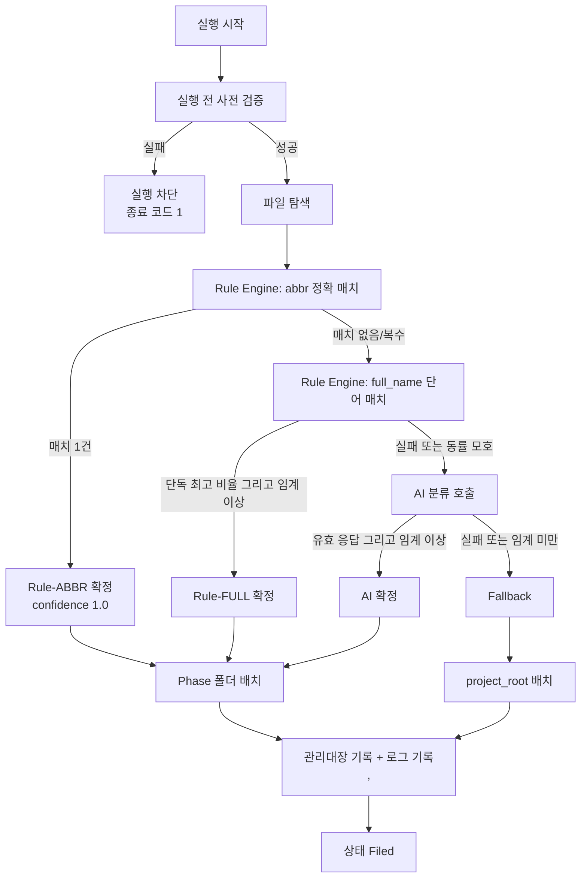

# IDMA(제출물 관리대장 자동화 시스템) 소프트웨어 요구사항 명세서 (SRS)

## 1. 개요

본 문서는 IDMA(제출물 관리대장 자동화 시스템)의 소프트웨어 요구사항을 정의한다.
IDMA는 `source_root`에 유입된 제출물 파일을 파일명 기반으로 단계(Phase)를 판정해
해당 Phase 폴더로 배치하고, 판정에 실패한 파일을 `project_root`에 안전하게
배치하며(Fallback), 그 결과를 제출물 관리대장(xlsx)과 실행 로그에 자동 기록하는
로컬 Python 애플리케이션이다. 분류는 결정론적 Rule Engine을 1차 수단으로,
AI 분류를 보조 수단으로 사용하는 Hybrid 구조다.

본 SRS는 `docs/1.Concept/PRD.md`(이하 PRD)를 상위 문서로 하며, PRD의
<PRD-U001>~<PRD-U005>, <PRD-A001>~<PRD-A008>, <PRD-F001>~<PRD-F018>,
<PRD-N001>~<PRD-N006>을 소프트웨어 수준의 검증 가능한 요구사항으로 정제한다.

본 문서에서 "시스템"은 IDMA 실행 엔진(CLI)과 로컬 설정 UI를 합한 소프트웨어
전체를 가리킨다. 구현자의 재량을 줄이기 위해 경계값·수치·오류 처리·데이터
스키마를 본문에 확정한다. PRD에 근거 값이 없는 항목은 본 SRS에서 기본값을
확정하고, 해당 요구사항의 `상위요건:` 줄에 `설계 결정`으로 표시한다.

## 2. 범위

**In (이번 구현 범위)**
- 파일 탐색: `roots.source_root` 하위의 처리 대상 파일 목록 수집.
- Rule Engine 분류: `artifact.abbr` 정확 매치(우선순위 1), `artifact.full_name`
  단어 매치 비율 판정(우선순위 2), 다중 후보 충돌 처리.
- AI 보조 분류: Rule이 판정하지 못한 케이스에 한한 호출. 분류 모델은 추상화
  인터페이스 뒤에 두며 구체 모델·API 선택은 SDD에서 구체화한다.
- 파일 배치: Phase 폴더 배치, Fallback 배치, 파일명 보존·중복 suffix 정책.
- 상태 모델: `Ready`/`Rule-Classified`/`AI-Classified`/`Fallback`/`Filed`/`Error`.
- 제출물 관리대장(xlsx) 8개 컬럼 기록.
- 실행 로그 기록(JSON Lines).
- 실행 전 사전 검증(config·Knowledge 파싱, phase 정합, 경로 접근성, threshold 범위).
- 로컬 Python 설정 UI: `ledger.config.yaml` 편집·저장·유효성 검증.

**Out (범위 외 — PRD 6절과 동일)**
- `문서목록.json`(Knowledge Layer)의 도구 내 편집 기능. 도구는 읽기 전용으로만
  접근하며 UI에도 편집 화면을 두지 않는다.
- CWD(현재 작업 디렉토리) 기준 경로 해석. 모든 경로는 `project_root` 기준
  해석만 지원한다.
- 파일 내용(이미지·도형·본문 텍스트) 기반 분류. v1은 파일명 기반 분류만 지원한다.
- 분류 실패 파일의 자동 재시도·자동 재분류. 실패 시 Fallback 배치 후 사용자
  확인을 전제한다.
- 관리대장 워크북의 서식·수식·시트 구조 변경. 시스템은 지정된 데이터 행 추가만
  수행한다.
- 상주 프로세스(데몬·폴링·스케줄러) 형태의 자동 감시 실행.

## 3. 정의 및 약어

| 용어 | 의미 |
|------|------|
| IDMA | 본 시스템의 약칭(Input Document Management Automation) |
| Phase | 제출물이 속하는 프로젝트 단계. `문서목록.json`이 정의하는 값의 집합 |
| Knowledge Layer | 분류 기준 데이터 계층. 파일은 `문서목록.json`, 시스템은 읽기 전용으로만 접근 |
| Runtime Config Layer | 운영 설정 계층. 파일은 `ledger.config.yaml`, UI로 편집 가능 |
| artifact | 제출물 종류 1건. `abbr`(약어)와 `full_name`(정식명)과 `phase`를 가진다 |
| abbr | 제출물 약어. 예: `SCMP`, `SVVP` |
| full_name | 제출물 정식명. 공백으로 구분된 1개 이상의 단어로 구성된다 |
| Rule Engine | `문서목록.json`을 기준으로 파일명을 결정론적으로 판정하는 분류기 |
| AI Classifier | Rule Engine이 판정하지 못한 케이스에만 호출되는 보조 분류기 |
| Fallback | 분류 실패 파일을 `project_root` 바로 아래에 배치하는 안전 처리 |
| confidence | 분류 결과의 신뢰도. 0.0 이상 1.0 이하의 실수 |
| 토큰(token) | 파일명(확장자 제외)을 구분자로 분리한 문자열 조각. 정의는 <SRS-F010> |
| 매치 비율 | full_name 단어 중 파일명에 포함된 단어 수 ÷ full_name 전체 단어 수 |
| classification_method | 분류 수단 식별자. `Rule-ABBR`/`Rule-FULL`/`AI`/`Fallback` |
| 관리대장 | 제출물 관리대장 워크북(xlsx). 경로는 `workbook.path` |
| project_root | 모든 상대경로 해석의 기준 디렉토리이자 Fallback 배치 위치 |
| source_root | 처리 대상 파일이 유입되는 디렉토리 |
| phase_folders | Phase 값 → 배치 폴더 상대경로의 매핑 |
| 실행 단위(run) | CLI 1회 실행. 고유한 `run_id`를 가진다 |
| JSON Lines | 1줄 1 JSON 객체로 구성된 텍스트 파일 형식(확장자 `.jsonl`) |
| SRS-F / SRS-N | 기능 요구사항 / 비기능 요구사항 식별자 |

## 4. 참조 문서

- `docs/1.Concept/PRD.md` — IDMA 제품 요구사항 명세(상위 문서, 본 SRS의 유일한
  승인 상위 베이스라인).
- `docs/notes/제출물 관리 자동화 원본 스케치 v1.0.0.md` — 원본 설계 스케치.
  시스템 흐름도·Runtime Config 스키마·상태 모델의 배경 자료이며, 게이트 검사
  대상이 아닌 참고 자료다. 본 SRS와 충돌하는 내용은 본 SRS가 우선한다.
- `.claude/skills/by-srs-writer/references/srs-template.md` — 본 문서 양식.
- IEEE Std 830-1998 — 본 문서의 구성·품질 기준.

## 5. 전체 설명

### 5.1 이해관계자·사용자
- 주 사용자: 프로젝트 제출물 접수·관리 담당자. 비개발자 실무자를 포함한다.
  CLI 실행과 설정 UI 조작을 직접 수행한다.
- Knowledge 관리자: `문서목록.json`을 직접 편집하는 담당자. 주 사용자와 동일
  인물일 수 있다. 시스템은 이 파일을 쓰지 않는다(<PRD-U005>).

### 5.2 운영 환경
- OS: 로컬 Windows PC. 네트워크 드라이브·OneDrive 동기화 폴더를
  `project_root`·`source_root`로 지정할 수 있다.
- 런타임: Python 3.11 이상.
- 실행 형태: 온디맨드 CLI 1회 실행 + 로컬 Python GUI 설정 도구. 상주 프로세스
  없음.
- 배포 형태: 로컬 Python 애플리케이션(소스 실행 또는 단일 실행 파일 패키징).

### 5.3 시스템 구성(3계층)
1. **데이터 계층** — `문서목록.json`(Knowledge, 읽기 전용)과
   `ledger.config.yaml`(Runtime Config, UI 편집 가능)을 분리해 보유한다
   (<SRS-F001>~<SRS-F003>).
2. **처리 계층** — 파일 탐색 → Rule Engine → (필요 시) AI Classifier →
   Phase Resolver → File Mover → 관리대장 갱신 + 로그 기록 순의 파이프라인을
   구성한다(<SRS-F007>~<SRS-F034>).
3. **설정 UI 계층** — Runtime Config만 편집·검증·저장한다. Knowledge 편집
   기능은 제공하지 않는다(<SRS-F040>~<SRS-F043>).

### 5.4 처리 흐름

아래 그림 5-1은 파일 1건의 처리 흐름이다. 각 분기의 정확한 판정 조건은 6장의
해당 요구사항에 정의하며, 본 그림은 설명용이다.



그림 5-1. 파일 1건의 분류·배치 흐름(설명용).

### 5.5 가정 및 의존성
- `문서목록.json`은 실행 시점에 유효한 JSON이며, 각 artifact 항목이 `abbr`,
  `full_name`, `phase` 키를 가진다. 스키마는 8.3절에 정의한다.
- `ledger.config.yaml`은 8.2절 스키마를 따른다.
- 관리대장 워크북은 실행 시점에 다른 프로세스에 의해 배타적으로 잠겨 있지
  않다. 잠긴 경우의 동작은 <SRS-F033>에 정의한다.
- `project_root`·`source_root`·Phase 폴더가 위치한 파일 시스템은 파일 이동과
  디렉토리 생성 권한을 시스템에 부여한다.
- 파일명은 OS가 허용하는 문자로 구성되며, 시스템은 파일명을 UTF-8 문자열로
  다룬다.

## 6. 기능 요구사항

### 6.1 데이터 계층·경로 해석

[SRS-F001] Knowledge Layer 읽기 전용 취급
상위요건: <PRD-F001>, <PRD-U005>, <PRD-N006>
시스템은 `문서목록.json`을 읽기 전용 Knowledge Layer로 취급한다. 시스템의 어떤
실행 경로도 이 파일에 쓰기·이름 변경·삭제 연산을 수행하지 않는다. 이 파일은
매 실행 시작 시점에 1회 로드하며, 실행 중에는 메모리 상의 사본만 사용한다.
파일이 존재하지 않거나 JSON 파싱에 실패하면 <SRS-F004>의 사전 검증에서 실행을
차단한다.

[SRS-F002] Runtime Config Layer 로드·저장
상위요건: <PRD-F002>, <PRD-A006>, <PRD-N002>
시스템은 `ledger.config.yaml`을 Runtime Config Layer로 취급하며, 8.2절 스키마의
다음 8개 키를 보유한다: `project_root`, `workbook.path`, `roots.source_root`,
`roots.phase_folders`, `rule.full_name_min_ratio`, `ai.confidence_threshold`,
`fallback.enabled`, `duplicate.suffix_start`. CLI 실행 시작 시 이 파일을 로드하고,
설정 UI가 저장을 요청하면 <SRS-F042>의 유효성 검증을 통과한 경우에만 동일 경로에
YAML로 기록한다. 파일이 존재하지 않거나 YAML 파싱에 실패하면 <SRS-F004>의 사전
검증에서 실행을 차단한다.

[SRS-F003] project_root 기준 경로 해석
상위요건: <PRD-F003>, <PRD-A008>, <PRD-N001>
시스템은 설정·Knowledge에 기재된 모든 상대경로를 `project_root`를 기준으로
resolve한다. 현재 작업 디렉토리(CWD)를 기준으로 경로를 해석하는 코드 경로는
존재하지 않는다. `project_root` 자체가 상대경로로 기재된 경우
`ledger.config.yaml` 파일이 위치한 디렉토리를 기준으로 resolve한다. 동일한 설정
파일과 동일한 입력 파일 집합에 대해, 서로 다른 CWD에서 실행한 결과의
`result_path`·`phase`·`classification_method`·`status` 값은 동일하다.

[SRS-F004] 실행 전 사전 검증
상위요건: <PRD-F017>
시스템은 파일 탐색 이전에 다음 5개 항목을 순서대로 검증한다.
(1) `ledger.config.yaml` 파싱 성공 및 8개 필수 키 존재.
(2) `문서목록.json` 파싱 성공 및 8.3절 스키마 준수.
(3) `roots.phase_folders`의 키 집합이 `문서목록.json`에 등장하는 phase 값 집합과
    완전히 일치(양방향 포함, 차집합 0건).
(4) `project_root`·`roots.source_root`·`workbook.path`의 상위 디렉토리가 존재하고
    읽기·쓰기 접근이 가능.
(5) `rule.full_name_min_ratio`가 0.0 초과 1.0 이하, `ai.confidence_threshold`가
    0.0 이상 1.0 이하, `duplicate.suffix_start`가 1 이상의 정수.
5개 중 1개라도 실패하면 어떤 파일도 이동하지 않고 관리대장도 갱신하지 않은 채
종료 코드 1로 실행을 차단하며, 실패한 검증 항목 번호와 원인 메시지를 stderr와
로그에 기록한다.

[SRS-F005] Knowledge 재로드
상위요건: <PRD-A007>, <PRD-U005>
시스템은 `문서목록.json`의 내용을 캐시 파일·데이터베이스·코드에 복제해 보관하지
않는다. 사용자가 `문서목록.json`을 수정한 뒤 별도의 반영·동기화 절차 없이
CLI를 재실행하면, 그 실행의 분류 판정은 수정된 내용만을 기준으로 수행된다.

[SRS-F006] 분류 기준·설정의 외부 파일화
상위요건: <PRD-N006>, <PRD-F001>, <PRD-F002>
시스템은 Phase 목록, artifact 약어·정식명, 경로, 매치 비율 임계값, AI 임계값,
Fallback 사용 여부, 중복 suffix 시작값을 소스 코드에 상수로 하드코딩하지 않는다.
이 값들은 전부 `문서목록.json` 또는 `ledger.config.yaml`에서 읽는다.
단, 요구사항 <SRS-F012>의 confidence 등급값(0.8, 0.6)과 요구사항 <SRS-F011>의
abbr confidence 값(1.0)은 분류 알고리즘의 일부로 코드에 정의한다.

### 6.2 파일 탐색

[SRS-F007] 대상 파일 탐색
상위요건: <PRD-F004>, <PRD-U001>
시스템은 `roots.source_root` 디렉토리의 직속 항목 중 일반 파일만 처리 대상으로
수집한다. 하위 디렉토리는 재귀 탐색하지 않는다. 다음은 대상에서 제외한다:
디렉토리, 심볼릭 링크, 파일명이 `.` 또는 `~$`로 시작하는 파일, 크기 0바이트인
파일. 수집된 각 파일은 초기 상태 `Ready`를 가진다. 수집 결과가 0건이면 시스템은
관리대장을 갱신하지 않고 종료 코드 0으로 정상 종료하며, 로그에 대상 0건을
기록한다.

[SRS-F008] 처리 순서와 독립성
상위요건: <PRD-F004>
시스템은 수집된 파일을 파일명 오름차순(대소문자 무시, 유니코드 코드포인트
기준)으로 1건씩 순차 처리한다. 파일 1건의 처리 실패는 다른 파일의 처리를
중단시키지 않는다. 처리 중 예외가 발생한 파일은 상태 `Error`로 기록하고
(<SRS-F025>) 다음 파일 처리를 계속한다.

### 6.3 Rule Engine

[SRS-F010] 파일명 토큰화
상위요건: 설계 결정 (<PRD-F005>의 "토큰 단위 비교" 구체화)
시스템은 파일명에서 마지막 마침표 이후의 확장자를 제거한 나머지 문자열을
토큰화한다. 토큰 구분자는 공백, 언더스코어(`_`), 하이픈(`-`), 마침표(`.`),
소괄호(`(`, `)`), 대괄호(`[`, `]`), 쉼표(`,`)로 한다. 연속 구분자는 하나로
취급하고, 길이 0인 토큰은 버린다. 모든 토큰은 비교 전에 소문자로 정규화한다.
확장자가 없는 파일명은 전체 문자열을 토큰화 대상으로 한다.

[SRS-F011] Rule Engine — abbr 정확 매치
상위요건: <PRD-F005>, <PRD-A001>
시스템은 `문서목록.json`의 각 artifact `abbr`를 소문자로 정규화한 뒤,
요구사항 <SRS-F010>의 토큰 집합에 그와 완전히 동일한 토큰이 존재하는지
검사한다. 부분 문자열 포함은 매치로 인정하지 않는다. 매치된 artifact가 정확히 1건이면 그
artifact를 확정하고 `classification_method`를 `Rule-ABBR`,
`confidence`를 1.0으로 설정하며 AI 분류를 호출하지 않는다. abbr 매치는
우선순위 1로서, 매치가 1건 성립하면 full_name 매칭을 수행하지 않는다. 매치된
artifact가 2건 이상이면 abbr 판정을 실패로 처리하고 <SRS-F014>에 따라 AI 분류로
넘긴다. 매치가 0건이면 <SRS-F012>의 full_name 매칭을 수행한다.

[SRS-F012] Rule Engine — full_name 단어 매치
상위요건: <PRD-F006>, <PRD-A002>
시스템은 각 artifact의 `full_name`을 공백 기준으로 단어 분리하고, 각 단어를
소문자로 정규화한다. 파일명 토큰 집합(<SRS-F010>)에 포함된 단어의 개수를
`matched`, full_name 전체 단어 수를 `total`이라 할 때 매치 비율은
`ratio = matched / total`이다. `total`이 0인 artifact는 후보에서 제외한다.
`ratio`가 `rule.full_name_min_ratio`(기본값 0.5) 미만인 artifact는 후보에서
제외한다. 후보로 남은 artifact의 confidence는 `ratio`가 0.7 이상이면 0.8,
0.5 이상 0.7 미만이면 0.6으로 한다. `rule.full_name_min_ratio`가 0.5가 아닌
값으로 설정된 경우에도 confidence 등급 경계값(0.7)은 변경되지 않으며,
`ratio`가 `rule.full_name_min_ratio` 이상 0.7 미만인 구간의 confidence는
0.6으로 한다. 후보가 0건이면 Rule 판정 실패로 <SRS-F014>에 따라 AI 분류로
넘긴다.

[SRS-F013] Rule Engine — 다중 후보 충돌 처리
상위요건: <PRD-F007>, <PRD-A003>
요구사항 <SRS-F012>의 후보가 2건 이상이면 시스템은 `ratio`가 가장 높은 후보를
선택한다.
최고 `ratio`를 가진 후보가 정확히 1건이면 그 artifact를 확정하고
`classification_method`를 `Rule-FULL`로 설정한다. 최고 `ratio`가 동일한 후보가
2건 이상이면 모호(ambiguous) 상태로 판정하고 <SRS-F014>에 따라 AI 분류를
호출한다. 후보가 1건이면 그 후보를 그대로 확정하고 `Rule-FULL`로 설정한다.

### 6.4 AI 보조 분류

[SRS-F014] AI 분류 호출 조건
상위요건: <PRD-F008>, <PRD-A003>, <PRD-N003>
시스템은 다음 3개 조건 중 하나 이상에 해당하는 경우에만 AI 분류를 호출한다.
(1) Rule 매칭 실패: abbr 매치 0건이고 full_name 후보도 0건.
(2) 모호: abbr 매치 2건 이상, 또는 최고 `ratio` 동률 후보 2건 이상(<SRS-F013>).
(3) 임계 미만: Rule이 확정한 confidence가 `ai.confidence_threshold` 미만.
위 3개 조건 중 어느 것에도 해당하지 않는 파일에 대해서는 AI 분류를 호출하지
않으며, 그 실행의 AI 호출 횟수에도 포함되지 않는다. `Rule-ABBR`로 확정된
파일은 confidence가 1.0이므로 조건 (3)에 해당하지 않는다.

[SRS-F015] AI 분류 입출력 계약
상위요건: <PRD-F009>
AI 분류 인터페이스의 입력은 (a) 확장자를 포함한 원본 파일명 문자열,
(b) `문서목록.json`에서 로드한 artifact 목록(각 항목의
`abbr`, `full_name`, `phase`)이다. 출력은 `artifact_abbr`(문자열),
`phase`(문자열), `ai_confidence`(0.0 이상 1.0 이하의 실수) 3개 필드를 가진
객체다. 시스템은 파일 내용을 읽어 AI 입력에 포함하지 않는다.

[SRS-F016] AI 분류 결과 채택 조건
상위요건: <PRD-F008>, <PRD-F009>, <PRD-N003>
시스템은 AI 응답을 다음 4개 조건을 모두 만족하는 경우에만 채택한다.
(1) 응답이 <SRS-F015>의 3개 필드를 모두 포함한다.
(2) `artifact_abbr`가 `문서목록.json`에 존재하는 abbr 값과 일치한다.
(3) `phase`가 해당 artifact의 phase 값과 일치하고 `roots.phase_folders`의 키에
    존재한다.
(4) `ai_confidence`가 `ai.confidence_threshold` 이상이다.
채택 시 `classification_method`를 `AI`로 설정하고 `ai_confidence`를 기록한다.
4개 조건 중 하나라도 실패하면 AI 분류 실패로 판정하고 <SRS-F022>의 Fallback으로
넘기며, 실패한 조건 번호를 `error_message`에 기록한다.

[SRS-F017] AI 분류기 추상화와 실패 처리
상위요건: <PRD-N003>, <PRD-N006>
AI 분류기는 <SRS-F015>의 입출력 계약만을 노출하는 단일 추상화 인터페이스 뒤에
둔다. 호출부는 구현체가 로컬 모델인지 원격 API인지에 의존하지 않는다. 구체
구현체(모델·엔드포인트·프롬프트·인증 방식) 선택은 SDD에서 구체화한다.
AI 호출이 예외로 실패하거나 응답이 30초 이내에 완료되지 않으면 시스템은 그
파일의 AI 분류를 실패로 판정하고(<SRS-F016>) Fallback으로 넘긴다. AI 호출 실패는
다른 파일의 처리를 중단시키지 않으며, 실행 자체를 종료시키지 않는다.
`fallback.enabled`가 `false`인 경우의 동작은 <SRS-F023>에 정의한다.

### 6.5 파일 배치

[SRS-F020] 정상 분류 배치 경로
상위요건: <PRD-F010>, <PRD-U001>
분류에 성공한 파일의 배치 경로는
`project_root / roots.phase_folders[phase] / 원본파일명`이다. 대상 디렉토리가
존재하지 않으면 시스템이 생성한다. 배치는 이동(move) 연산으로 수행하며, 배치
성공 시 `source_root`의 원본 파일은 남지 않는다. 배치가 완료된 파일의 상태는
`Filed`가 된다.

[SRS-F021] 파일명 보존과 중복 처리
상위요건: <PRD-F012>, <PRD-A005>
시스템은 배치 시 원본 파일명과 확장자를 변경하지 않는다. 대상 경로에 동일
파일명이 이미 존재하면 기존 파일을 덮어쓰지 않는다. 이 경우 파일명의 확장자
앞에 `_<n>` 형태의 suffix를 붙이며, `n`은 `duplicate.suffix_start`(기본값 1)에서
시작해 충돌이 없는 경로가 나올 때까지 1씩 증가시킨다. 예: `보고서.pdf`가 이미
있으면 `보고서_1.pdf`, 그것도 있으면 `보고서_2.pdf`. 확장자가 없는 파일명은
문자열 끝에 `_<n>`을 붙인다. `n`이 `duplicate.suffix_start + 999`를 초과하면
배치를 중단하고 그 파일의 상태를 `Error`로 기록한다(<SRS-F025>).

[SRS-F022] Fallback 배치
상위요건: <PRD-F011>, <PRD-A004>, <PRD-U002>, <PRD-N004>
Rule 분류와 AI 분류가 모두 실패한 파일의 배치 경로는
`project_root / 원본파일명`이다. `classification_method`는 `Fallback`,
`phase`와 `artifact_abbr`는 빈 값, `status`는 `Filed`로 기록하고, 실패 사유를
`error_message`에 기록한다. 파일명 보존·중복 suffix 규칙은 <SRS-F021>과 동일하게
적용한다. Fallback 배치가 수행된 파일은 원본이 `source_root`에 남지 않으며
유실되지도 않는다.

[SRS-F023] Fallback 비활성 시 동작
상위요건: <PRD-F002>, <PRD-N004>
`fallback.enabled`가 `false`이면 시스템은 분류 실패 파일을 이동하지 않고
`source_root`에 그대로 둔다. 이 경우 관리대장에는 `classification_method`를
`Fallback`, `status`를 `Ready`, `result_path`를 원본 경로, `error_message`에
분류 실패 사유와 `fallback disabled`를 기록한다. 이 설정에서도 파일은 삭제되지
않으며, 어떤 경우에도 유실되지 않는다.

[SRS-F024] 배치 원자성
상위요건: <PRD-N004>, <PRD-A005>
시스템은 파일 이동이 성공적으로 완료된 뒤에만 그 파일의 관리대장 행을
`status=Filed`로 기록한다. 이동 도중 실패(권한 거부, 디스크 공간 부족, 경로
길이 초과 등)가 발생하면 시스템은 부분 복사본을 대상 경로에 남기지 않고
원본을 `source_root`에 보존한다. 이 파일의 상태는 `Error`로 기록한다.

[SRS-F025] 시스템 오류 상태
상위요건: <PRD-F013>
시스템은 분류 실패가 아니라 시스템 오류(파일 접근 예외, 이동 실패, suffix 한도
초과, 관리대장 행 기록 실패)가 발생한 경우에만 그 파일의 상태를 `Error`로
기록한다. `Error` 상태의 파일은 이동하지 않고 `source_root`에 보존하며,
`error_message`에 예외 유형과 원인 메시지를 기록한다. 분류에 실패했을 뿐인
파일은 `Error`가 아니라 <SRS-F022>의 `Fallback` 경로로 처리한다.

### 6.6 상태 모델

[SRS-F026] 파일 상태 전이
상위요건: <PRD-F013>
파일 1건의 상태는 다음 4개 경로 중 정확히 하나를 따른다.
(1) `Ready` → `Rule-Classified` → `Filed`
(2) `Ready` → `AI-Classified` → `Filed`
(3) `Ready` → `Fallback` → `Filed`
(4) `Ready` → `Error`
경로 (1)은 `classification_method`가 `Rule-ABBR` 또는 `Rule-FULL`인 경우,
(2)는 `AI`인 경우, (3)은 `Fallback`인 경우에 해당한다. 위에 정의되지 않은 상태
전이(예: `Filed` → `Fallback`, `Error` → `Filed`)는 발생하지 않는다.
`fallback.enabled`가 `false`인 경우 경로 (3)은 `Ready`에서 종료한다(<SRS-F023>).

### 6.7 관리대장 갱신

[SRS-F030] 관리대장 컬럼 구성
상위요건: <PRD-F014>, <PRD-U003>, <PRD-N005>
시스템은 처리한 파일 1건당 관리대장에 1개 행을 추가하며, 각 행은 8.4절에 정의된
다음 8개 컬럼을 순서대로 가진다: `original_filename`, `phase`,
`artifact_abbr`, `classification_method`, `ai_confidence`, `result_path`,
`status`, `error_message`. 각 컬럼의 값 도메인과 빈 값 규칙은 8.4절에 따른다.

[SRS-F031] classification_method 기록값
상위요건: <PRD-F014>, <PRD-N005>
`classification_method` 컬럼의 값은 `Rule-ABBR`, `Rule-FULL`, `AI`, `Fallback`
4개 중 하나다. 이 외의 값은 기록하지 않는다. 값과 판정 경로의 대응은
요구사항 <SRS-F011>, <SRS-F013>, <SRS-F016>, <SRS-F022>에 정의한 바와 같다.

[SRS-F032] ai_confidence 기록 조건
상위요건: <PRD-F014>, <PRD-F009>
`ai_confidence` 컬럼은 `classification_method`가 `AI`인 행에만 AI가 반환한
confidence 값을 소수점 둘째 자리까지 기록한다. `Rule-ABBR`, `Rule-FULL`,
`Fallback` 행의 `ai_confidence`는 빈 값으로 둔다. AI를 호출했으나 결과가
채택되지 않아 Fallback으로 처리된 행도 빈 값으로 둔다.

[SRS-F033] 관리대장 쓰기 안전성
상위요건: <PRD-U003>, <PRD-N004>
시스템은 관리대장 워크북을 열기 전에 원본을 `<원본파일명(확장자 제외)>_<run_id>.xlsx`
이름으로 `project_root` 하위 `backup` 디렉토리에 복사한다. 워크북이 다른
프로세스에 의해 배타적으로 잠겨 있으면 파일을 이동하지 않고 종료 코드 2로
종료하며, "관리대장을 닫은 뒤 재실행"을 안내하는 메시지를 stderr와 로그에
기록한다. 시스템은 관리대장의 기존 행·시트·수식·서식을 변경하지 않고, 지정된
대상 시트의 마지막 데이터 행 아래에 새 행만 추가한다.

### 6.8 로그

[SRS-F034] 실행 로그 기록 항목
상위요건: <PRD-F018>, <PRD-N005>
시스템은 실행마다 8.5절 스키마의 로그 레코드를 기록한다. 실행 단위 레코드는
실행 시각(ISO 8601, 로컬 타임존 오프셋 포함), `run_id`, 설정 파일 절대경로,
설정 파일 버전(`config_version`, 없으면 파일 내용의 SHA-256 앞 8자리),
Knowledge 파일 절대경로를 포함한다. 파일 단위 레코드는 원본 파일명,
`classification_method`(분류 방식), 매칭 근거(`match_evidence`), 최종 경로,
fallback 여부(`is_fallback`, 불리언)를 포함한다.

[SRS-F035] 매칭 근거 기록
상위요건: <PRD-F018>, <PRD-N005>
`match_evidence` 필드는 판정 경로별로 다음을 포함한다.
- `Rule-ABBR`: 매치된 abbr 문자열과 매치된 파일명 토큰.
- `Rule-FULL`: 매치된 full_name, `matched`/`total` 단어 수, `ratio`(소수점 셋째
  자리), 매치된 단어 목록.
- `AI`: AI 호출 사유(조건 번호 1/2/3), 반환된 `artifact_abbr`·`phase`·
  `ai_confidence`.
- `Fallback`: 실패한 단계(Rule 실패 / AI 실패)와 실패 사유.
이 필드는 사람이 판정 결과를 재검토할 수 있는 근거가 되며, 값을 생략하지 않는다.

[SRS-F036] 로그 파일 위치와 형식
상위요건: 설계 결정 (<PRD-F018>의 저장 형식 구체화)
로그는 `project_root / logs / idma-<YYYYMMDD>.jsonl` 파일에 JSON Lines 형식으로
누적 기록한다. 1줄은 1개 JSON 객체이며, 인코딩은 UTF-8, 줄바꿈은 `\n`이다.
`logs` 디렉토리가 없으면 시스템이 생성한다. 실행마다 기존 로그 파일을 덮어쓰지
않고 append한다. 로그 기록 실패는 파일 처리를 중단시키지 않으며, 이 경우
시스템은 stderr에 경고를 출력하고 처리를 계속한다.

### 6.9 로컬 설정 UI

[SRS-F040] UI 제공 항목
상위요건: <PRD-F015>, <PRD-U004>
로컬 Python UI는 다음 7개 설정 항목의 조회·편집과 저장 동작을 제공한다:
`project_root`, `roots.source_root`, `roots.phase_folders`,
`rule.full_name_min_ratio`, `ai.confidence_threshold`, `fallback.enabled`,
`duplicate.suffix_start`. 디렉토리 경로 항목은 직접 입력과 폴더 선택 대화상자
양쪽을 지원한다. `roots.phase_folders`는 phase 키와 폴더 상대경로 쌍의 목록으로
표시하며, 행 추가·삭제·수정을 지원한다.

[SRS-F041] UI 비제공 항목
상위요건: <PRD-F016>, <PRD-U005>
로컬 Python UI는 `문서목록.json`의 내용을 편집·저장하는 화면과 동작을 제공하지
않는다. Phase 목록·abbr·full_name을 UI에서 추가·수정·삭제할 수 없다. UI는
`문서목록.json`의 현재 내용을 읽기 전용으로 표시할 수 있으나, 어떤 조작으로도
그 파일에 쓰기를 수행하지 않는다.

[SRS-F042] UI 저장 전 유효성 검증
상위요건: <PRD-F002>, <PRD-A006>, <PRD-F017>
UI는 저장 요청 시 다음을 검증한다: `rule.full_name_min_ratio`가 0.0 초과 1.0
이하의 실수, `ai.confidence_threshold`가 0.0 이상 1.0 이하의 실수,
`duplicate.suffix_start`가 1 이상의 정수, `project_root`와
`roots.source_root`가 존재하는 디렉토리, `roots.phase_folders`의 키 집합이
`문서목록.json`의 phase 값 집합과 일치, `workbook.path`의 상위 디렉토리가 존재.
1개라도 실패하면 파일에 쓰지 않고 실패 항목과 사유를 화면에 표시한다.

[SRS-F043] UI 설정 영속화
상위요건: <PRD-A006>, <PRD-U004>
요구사항 <SRS-F042>의 검증을 통과한 저장 요청은 `ledger.config.yaml` 파일에
반영된다.
시스템은 기존 파일을 임시 파일에 먼저 기록한 뒤 교체하는 방식으로 저장하여,
저장 도중 실패 시 기존 설정 파일이 손상되지 않도록 한다. 저장 완료 후 UI를
종료하고 재실행하면 저장된 값이 그대로 표시된다. UI가 저장한 설정은 이후의
CLI 실행에 별도 절차 없이 적용된다.

## 7. 비기능 요구사항

[SRS-N001] 경로 해석 결정성
상위요건: <PRD-N001>, <PRD-A008>
동일한 `ledger.config.yaml`·`문서목록.json`·입력 파일 집합에 대해, 서로 다른
CWD(예: `project_root` 내부, 시스템 드라이브 루트, 사용자 홈)에서 실행한 3회
결과의 관리대장 행 집합은 `original_filename`·`phase`·`artifact_abbr`·
`classification_method`·`result_path`·`status` 6개 컬럼 값이 모두 동일하다.
회귀 테스트는 이 3회 실행 결과를 비교해 확인한다.

[SRS-N002] 설정 확장성
상위요건: <PRD-N002>, <PRD-N006>
`roots.phase_folders`에 새 phase 항목을 추가하고 `문서목록.json`에 해당 phase의
artifact를 추가하는 것만으로, 소스 코드 수정·재빌드 없이 그 phase로의 분류·배치가
동작한다. 회귀 테스트는 신규 phase 1건을 설정·Knowledge에만 추가한 뒤 해당
phase로 분류되는 파일이 정상 배치됨을 확인한다.

[SRS-N003] AI 의존도 최소화
상위요건: <PRD-N003>, <PRD-A001>, <PRD-A003>
요구사항 <SRS-F014>의 3개 조건에 해당하지 않는 파일에 대한 AI 호출 횟수는
0건이다.
회귀 테스트는 abbr가 파일명에 포함된 파일 10건 이상을 입력했을 때 AI 분류기
인터페이스 호출 횟수가 0인 것을 확인한다. AI 분류기 구현체를 사용할 수 없는
환경에서도 Rule로 판정 가능한 파일의 분류·배치는 정상 동작한다.

[SRS-N004] 파일 무유실 보장
상위요건: <PRD-N004>, <PRD-U002>, <PRD-A004>
실행 전 `source_root`에 존재한 모든 대상 파일은 실행 후 다음 3개 위치 중
정확히 한 곳에 원본 파일명(또는 <SRS-F021>의 suffix가 붙은 이름)으로 존재한다:
Phase 폴더, `project_root` 직속, `source_root`(Fallback 비활성 또는 `Error`인
경우). 어떤 실행 경로에서도 대상 파일이 0개 위치에 존재하는 결과는 발생하지
않는다. 회귀 테스트는 정상·Rule 실패·AI 실패·이동 예외 4개 시나리오에 대해
실행 전후 파일 개수와 내용 해시를 비교해 확인한다.

[SRS-N005] 감사 추적성
상위요건: <PRD-N005>, <PRD-U003>, <PRD-F018>
처리된 모든 파일은 관리대장에 1개 행, 로그에 1개 파일 단위 레코드를 남긴다.
관리대장 행 수와 로그 파일 단위 레코드 수는 처리 대상 파일 수와 일치한다.
각 행·레코드는 `classification_method`와 `match_evidence`를 포함하여, 사후에
"왜 이 파일이 이 위치로 갔는가"를 재구성할 수 있다.

[SRS-N006] Knowledge 불변성
상위요건: <PRD-N006>, <PRD-U005>, <PRD-F001>
CLI 실행과 UI 조작을 통틀어 `문서목록.json`의 내용·수정 시각·권한은 변경되지
않는다. 회귀 테스트는 전체 파이프라인 실행 전후 이 파일의 SHA-256 해시와 수정
시각이 동일함을 확인한다.

[SRS-N007] 처리 성능
상위요건: 설계 결정 (성능 목표, PRD 근거 없음)
AI 분류 호출을 제외한 파일 1건당 처리 시간(탐색·Rule 판정·이동·관리대장 행
기록)은 로컬 디스크 기준 1초 이내다. `문서목록.json`의 artifact 항목 200건,
입력 파일 100건 규모의 1회 실행은 AI 호출을 제외하고 60초 이내에 완료된다.

[SRS-N008] 오류 보고 완결성
상위요건: 설계 결정 (<SRS-F004>, <SRS-F025> 오류 경로 대응)
0이 아닌 종료 코드로 끝나는 모든 실행과, `status`가 `Error`인 모든 파일은
원인 메시지를 stderr와 로그에 남긴다. 스택 트레이스만 출력하고 원인 메시지 없이
끝나는 실패 경로는 존재하지 않는다.

## 8. 인터페이스 요구사항

### 8.1 CLI 인터페이스

```
idma run   [--config <경로>] [--dry-run]
idma ui    [--config <경로>]
```

- `--config`: `ledger.config.yaml` 경로. 생략 시 CWD의 `ledger.config.yaml`을
  찾고, 없으면 종료 코드 1. 설정 파일을 찾은 뒤의 모든 경로 해석은 <SRS-F003>에
  따라 `project_root` 기준이다.
- `--dry-run`: 파일 이동·관리대장 갱신·설정 저장을 수행하지 않고, 각 파일의 판정
  결과와 배치 예정 경로만 stdout에 출력한다. 로그는 기록한다.
- 종료 코드: 0=정상 종료(처리 대상 0건 포함), 1=사전 검증 실패 또는 설정 오류,
  2=관리대장 접근 불가(잠김·권한), 3=1건 이상의 파일이 `Error` 상태로 종료.
- stdout: 처리 요약(대상 건수, method별 건수, Error 건수). stderr: 오류·경고.

### 8.2 Runtime Config 스키마 (`ledger.config.yaml`)

```yaml
project_root: "D:/WORK/PRJ-A"        # 필수. 절대경로 또는 설정 파일 기준 상대경로
config_version: "1.0.0"              # 선택. 없으면 파일 SHA-256 앞 8자리를 사용
workbook:
  path: "0.관리/제출물관리대장.xlsx"   # 필수. project_root 기준 상대경로 허용
  sheet: "관리대장"                    # 선택. 기본값 "관리대장"
roots:
  source_root: "0.접수"               # 필수. project_root 기준 상대경로 허용
  phase_folders:                      # 필수. 키 집합 = 문서목록.json의 phase 집합
    착수: "1.착수"
    개념: "2.개념"
    기본: "3.기본"
    상세: "4.상세"
rule:
  full_name_min_ratio: 0.5            # 필수. 0.0 초과 1.0 이하
ai:
  confidence_threshold: 0.7           # 필수. 0.0 이상 1.0 이하
fallback:
  enabled: true                       # 필수. 불리언
duplicate:
  suffix_start: 1                     # 필수. 1 이상의 정수
```

- `ai.confidence_threshold`의 기본값 0.7은 설계 결정이다. Rule-FULL의 최고
  confidence 등급(0.8)은 이 임계를 넘고 하위 등급(0.6)은 넘지 못하므로,
  이 기본값에서 `ratio` 0.7 미만의 약한 Rule 판정은 AI 재확인을 거친다.
- 키가 누락되거나 값이 위 제약을 벗어나면 <SRS-F004>가 실행을 차단한다.
- 위 8개 필수 항목 외의 키는 무시하지 않고 그대로 보존해 저장한다(<SRS-F043>).

### 8.3 Knowledge 스키마 (`문서목록.json`)

```json
{
  "artifacts": [
    {
      "abbr": "SCMP",
      "full_name": "Software Configuration Management Plan",
      "phase": "착수"
    },
    {
      "abbr": "SVVP",
      "full_name": "Software Verification and Validation Plan",
      "phase": "착수"
    }
  ]
}
```

- `artifacts`는 1개 이상의 객체 배열이며, 각 객체는 `abbr`·`full_name`·`phase`
  3개 문자열 키를 필수로 가진다. 세 값 모두 빈 문자열이 아니어야 한다.
- 시스템은 이 파일을 읽기 전용으로만 접근한다(<SRS-F001>, <SRS-N006>).
- `abbr` 값은 파일 전체에서 유일하다. 중복이 있으면 <SRS-F004>가 실행을 차단한다.
- 파일 경로는 `project_root` 기준으로 해석한 `문서목록.json`이다.

### 8.4 관리대장 출력 데이터 스키마

관리대장 시트(`workbook.sheet`)의 데이터 행은 다음 8개 컬럼을 순서대로 가진다.

| 컬럼명 | 자료형 | 값 도메인 | 빈 값 허용 | 설명 |
|---|---|---|---|---|
| `original_filename` | 문자열 | 확장자 포함 원본 파일명 | 불가 | 배치 전 파일명. suffix가 붙어도 이 값은 원본을 유지 |
| `phase` | 문자열 | `문서목록.json`의 phase 값 | 가능 | `Fallback` 행은 빈 값 |
| `artifact_abbr` | 문자열 | `문서목록.json`의 abbr 값 | 가능 | `Fallback` 행은 빈 값 |
| `classification_method` | 문자열 | `Rule-ABBR`/`Rule-FULL`/`AI`/`Fallback` | 불가 | <SRS-F031> |
| `ai_confidence` | 실수 | 0.00~1.00, 소수점 둘째 자리 | 가능 | `AI` 행에만 기록(<SRS-F032>) |
| `result_path` | 문자열 | 절대경로 | 불가 | 배치 완료 경로. suffix가 붙은 경우 그 이름을 반영 |
| `status` | 문자열 | `Ready`/`Filed`/`Error` | 불가 | <SRS-F026> |
| `error_message` | 문자열 | 자유 텍스트 | 가능 | 분류 실패 사유 또는 시스템 오류 원인 |

- 컬럼 식별은 헤더명 기준이다. 대상 시트의 헤더 행에 위 8개 이름이 모두
  존재하지 않으면 <SRS-F004>가 실행을 차단한다.
- `status`가 `Rule-Classified`·`AI-Classified`·`Fallback`인 중간 상태는 관리대장에
  기록하지 않는다. 관리대장에는 최종 상태만 기록한다(<SRS-F026>).

### 8.5 로그 레코드 스키마 (`logs/idma-<YYYYMMDD>.jsonl`)

실행 단위 레코드(실행마다 1건, `type: "run"`):

```json
{
  "type": "run",
  "run_id": "20260909-143001-a1b2c3",
  "started_at": "2026-09-09T14:30:01+09:00",
  "config_path": "D:/WORK/PRJ-A/ledger.config.yaml",
  "config_version": "1.0.0",
  "knowledge_path": "D:/WORK/PRJ-A/문서목록.json",
  "source_root": "D:/WORK/PRJ-A/0.접수",
  "target_count": 12
}
```

파일 단위 레코드(처리한 파일마다 1건, `type: "file"`):

```json
{
  "type": "file",
  "run_id": "20260909-143001-a1b2c3",
  "original_filename": "PRJ-A_SCMP_Rev0.pdf",
  "classification_method": "Rule-ABBR",
  "match_evidence": {"abbr": "SCMP", "matched_token": "scmp"},
  "phase": "착수",
  "result_path": "D:/WORK/PRJ-A/1.착수/PRJ-A_SCMP_Rev0.pdf",
  "is_fallback": false,
  "status": "Filed",
  "error_message": null
}
```

- `match_evidence` 객체의 내용은 판정 경로별로 <SRS-F035>에 정의한 항목을
  포함한다.
- `run_id`는 `<YYYYMMDD>-<HHMMSS>-<임의 6자>` 형식이며 실행 단위 레코드와 그
  실행의 모든 파일 단위 레코드에서 동일하다.

### 8.6 AI 분류기 인터페이스

```
classify(filename: str, artifacts: list[Artifact]) -> AIResult | None
```

- `filename`: 확장자를 포함한 원본 파일명. 파일 내용은 전달하지 않는다.
- `artifacts`: 8.3절 스키마로 로드한 artifact 목록.
- `AIResult`: `artifact_abbr: str`, `phase: str`, `ai_confidence: float`.
- 반환값이 `None`이거나 예외가 발생하거나 30초를 초과하면 AI 분류 실패로
  판정한다(<SRS-F017>).
- 이 시그니처가 호출부와 구현체 사이의 유일한 계약이다. 구체 구현체(로컬 모델
  또는 원격 API), 프롬프트, 인증·재시도 정책은 SDD에서 구체화한다.

### 8.7 설정 UI 인터페이스

- 실행 형태: `idma ui`로 기동하는 로컬 Python GUI 창. 웹 서버·원격 접속 형태를
  사용하지 않는다.
- 화면 구성: 경로 설정 영역(`project_root`, `roots.source_root`,
  `workbook.path`), Phase 폴더 매핑 표(`roots.phase_folders`), 분류 파라미터
  영역(`rule.full_name_min_ratio`, `ai.confidence_threshold`), 정책 영역
  (`fallback.enabled`, `duplicate.suffix_start`), 저장 버튼.
- 저장 동작: <SRS-F042> 검증 → 통과 시 <SRS-F043> 저장 → 결과 메시지 표시.
  검증 실패 시 실패 항목별 사유를 화면에 표시하고 파일에 쓰지 않는다.
- Knowledge 영역: `문서목록.json` 내용을 읽기 전용 목록으로 표시할 수 있으며,
  편집 컨트롤(입력 필드·추가/삭제 버튼)을 제공하지 않는다(<SRS-F041>).

## 9. 제약사항

- 실행 환경은 Windows 로컬 PC이며, Python 3.11 이상이 설치되어 있어야 한다.
- 분류 판단의 유일한 입력은 파일명이다. 파일 내용을 열어 분류에 사용하지
  않는다(범위 외, 2장).
- 모든 경로 해석은 `project_root` 기준이며 CWD 기준 해석 코드는 존재하지 않는다
  (<SRS-F003>).
- 시스템은 `문서목록.json`에 어떤 쓰기 연산도 수행하지 않는다(<SRS-N006>).
- 시스템은 상주하지 않는다. 데몬·폴링·스케줄러 등록 코드를 포함하지 않는다.
- Rule Engine은 결정론적이다. 동일 입력·동일 Knowledge·동일 설정에 대해 항상
  동일한 판정을 낸다. 비결정성은 AI 분류 경로에만 존재할 수 있다.
- AI 분류기 구현체를 사용할 수 없는 환경에서도 시스템은 기동·실행되어야 하며,
  Rule로 판정 가능한 파일은 정상 배치된다(<SRS-N003>).
- 파일 배치는 이동(move)이며 복사 후 원본 유지 방식을 사용하지 않는다. 원본을
  남기는 유일한 경우는 <SRS-F023>(Fallback 비활성)과 <SRS-F025>(`Error`)이다.
- 관리대장 워크북의 기존 행·수식·서식·시트 구조는 변경하지 않는다(<SRS-F033>).
- 본 SRS에 정의되지 않은 동작이 구현 중 필요해지면 임의 구현하지 않고 SRS 개정을
  먼저 요청한다.

## 10. 부록

### 부록 A. PRD → SRS 추적성 매트릭스

| PRD ID | SRS ID |
|---|---|
| <PRD-U001> | <SRS-F007>, <SRS-F020> |
| <PRD-U002> | <SRS-F022>, <SRS-N004> |
| <PRD-U003> | <SRS-F030>, <SRS-F033>, <SRS-N005> |
| <PRD-U004> | <SRS-F040>, <SRS-F043> |
| <PRD-U005> | <SRS-F001>, <SRS-F005>, <SRS-F041>, <SRS-N006> |
| <PRD-A001> | <SRS-F011>, <SRS-N003> |
| <PRD-A002> | <SRS-F012> |
| <PRD-A003> | <SRS-F013>, <SRS-F014>, <SRS-N003> |
| <PRD-A004> | <SRS-F022>, <SRS-N004> |
| <PRD-A005> | <SRS-F021>, <SRS-F024> |
| <PRD-A006> | <SRS-F002>, <SRS-F042>, <SRS-F043> |
| <PRD-A007> | <SRS-F005> |
| <PRD-A008> | <SRS-F003>, <SRS-N001> |
| <PRD-F001> | <SRS-F001>, <SRS-F006>, <SRS-N006>, 8.3절 |
| <PRD-F002> | <SRS-F002>, <SRS-F006>, <SRS-F023>, <SRS-F042>, 8.2절 |
| <PRD-F003> | <SRS-F003> |
| <PRD-F004> | <SRS-F007>, <SRS-F008>, 5.4절 그림 5-1 |
| <PRD-F005> | <SRS-F010>, <SRS-F011> |
| <PRD-F006> | <SRS-F012> |
| <PRD-F007> | <SRS-F013> |
| <PRD-F008> | <SRS-F014>, <SRS-F016> |
| <PRD-F009> | <SRS-F015>, <SRS-F016>, <SRS-F032>, 8.6절 |
| <PRD-F010> | <SRS-F020> |
| <PRD-F011> | <SRS-F022> |
| <PRD-F012> | <SRS-F021> |
| <PRD-F013> | <SRS-F025>, <SRS-F026> |
| <PRD-F014> | <SRS-F030>, <SRS-F031>, <SRS-F032>, 8.4절 |
| <PRD-F015> | <SRS-F040> |
| <PRD-F016> | <SRS-F041> |
| <PRD-F017> | <SRS-F004>, <SRS-F042> |
| <PRD-F018> | <SRS-F034>, <SRS-F035>, <SRS-F036>, <SRS-N005>, 8.5절 |
| <PRD-N001> | <SRS-F003>, <SRS-N001> |
| <PRD-N002> | <SRS-F002>, <SRS-N002> |
| <PRD-N003> | <SRS-F014>, <SRS-F016>, <SRS-F017>, <SRS-N003> |
| <PRD-N004> | <SRS-F022>, <SRS-F023>, <SRS-F024>, <SRS-F033>, <SRS-N004> |
| <PRD-N005> | <SRS-F030>, <SRS-F031>, <SRS-F034>, <SRS-F035>, <SRS-N005> |
| <PRD-N006> | <SRS-F001>, <SRS-F006>, <SRS-F017>, <SRS-N002>, <SRS-N006> |

### 부록 B. 설계 결정 목록 (PRD에 근거 값이 없어 본 SRS에서 확정한 항목)

| 항목 | 확정값 | 근거 |
|---|---|---|
| 파일명 토큰 구분자 | 공백, `_`, `-`, `.`, `()`, `[]`, `,` | <PRD-F005>의 "토큰 단위 비교"를 실행 가능한 규칙으로 구체화. 제출물 파일명에서 실제로 쓰이는 구분자를 포괄한다(<SRS-F010>) |
| `ai.confidence_threshold` 기본값 | 0.7 | Rule-FULL 상위 등급(0.8)은 통과, 하위 등급(0.6)은 AI 재확인을 거치도록 하는 경계(<SRS-F014>, 8.2절) |
| AI 호출 타임아웃 | 30초 | 로컬 실행 도구의 응답성과 원격 API 지연을 함께 고려한 상한. 초과 시 Fallback으로 처리해 실행이 멈추지 않게 한다(<SRS-F017>) |
| 중복 suffix 상한 | `duplicate.suffix_start + 999` | 동일 파일명 무한 반복 시 무한 루프 방지(<SRS-F021>) |
| 로그 형식·위치 | `project_root/logs/idma-<YYYYMMDD>.jsonl`, JSON Lines, UTF-8 | <PRD-F018>이 기록 항목만 정의하고 형식을 정하지 않음. 기계 판독과 append 안전성을 위해 JSON Lines 채택(<SRS-F036>, 8.5절) |
| 관리대장 백업 | 실행 전 `project_root/backup/`에 `<파일명>_<run_id>.xlsx` 복사 | <PRD-N004> 운영 안정성을 관리대장 워크북까지 확장 적용(<SRS-F033>) |
| CLI 종료 코드 체계 | 0/1/2/3 | <PRD-F017>의 "실행 차단"을 호출자가 판별 가능한 형태로 구체화(8.1절) |
| 파일 탐색 범위 | `source_root` 직속 파일만, 비재귀 | PRD가 재귀 여부를 정하지 않음. Phase 폴더가 `project_root` 하위에 있어 재귀 탐색 시 배치 완료 파일의 재수집 위험이 있으므로 비재귀로 확정(<SRS-F007>) |
| 성능 목표 | 파일 1건당 1초, 100건 60초(AI 제외) | PRD에 성능 근거 없음. 로컬 디스크 파일 이동과 워크북 행 추가의 실측 가능한 상한으로 설정(<SRS-N007>) |
| 처리 순서 | 파일명 오름차순 | 실행 재현성 확보. 동일 입력에 대해 관리대장 행 순서가 동일하도록 함(<SRS-F008>) |
| AI 모델·API 선택 | SDD에서 구체화 | PRD가 구체 모델을 명시하지 않음. 본 SRS는 <SRS-F015>·<SRS-F017>·8.6절의 입출력 계약과 추상화 인터페이스만 고정하고, 구현체 선택은 설계 단계로 이관한다 |

### 부록 C. 요구사항 ID 색인

- 기능 요구사항(34건): SRS-F001~F008, SRS-F010~F017, SRS-F020~F026,
  SRS-F030~F036, SRS-F040~F043. 번호 사이의 빈 구간(F009, F018~F019,
  F027~F029, F037~F039)은 6장의 절 경계를 나타내며, 향후 같은 절에 요구사항을
  추가할 때 사용할 예비 번호다.
- 비기능 요구사항(8건): SRS-N001~N008.
