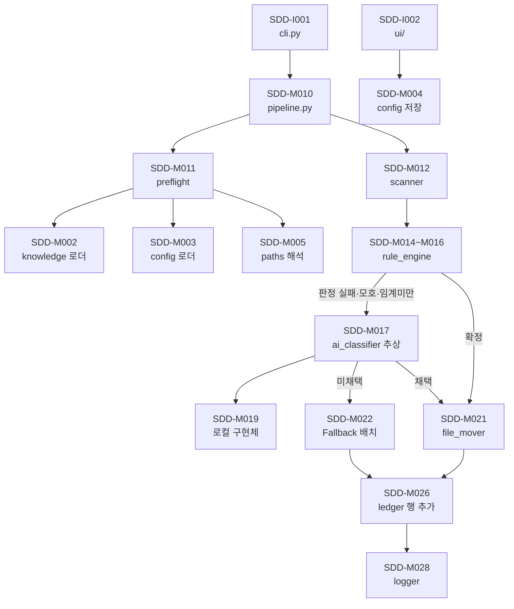
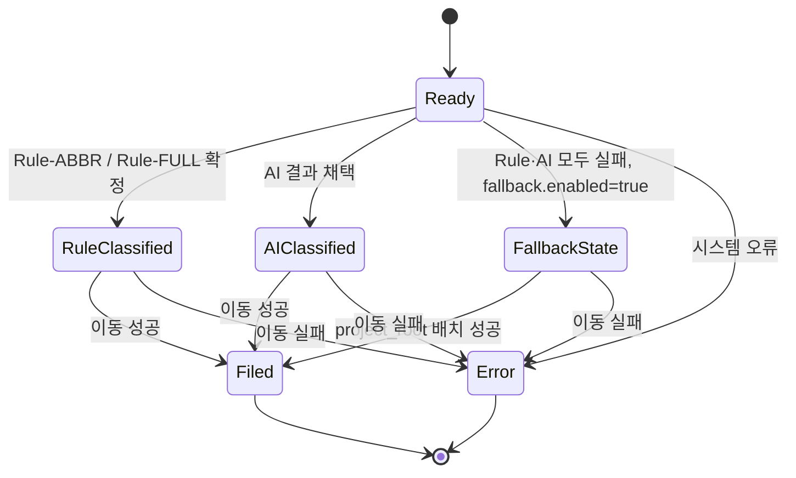
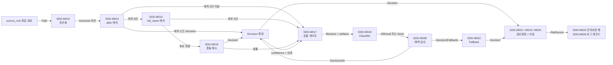

# IDMA(제출물 관리대장 자동화 시스템) 소프트웨어 설계 기술서 (SDD)

## 1. 개요

본 문서는 `docs/2.Requirement/SRS.md`(이하 SRS)를 상위 문서로 하여 IDMA의
소프트웨어 설계를 기술한다. SRS의 <SRS-F001>~<SRS-F043>(34건),
<SRS-N001>~<SRS-N008>(8건) 전건을 설계 항목으로 전개한다.

설계 항목 ID 체계는 다음과 같다.

| 접두 | 의미 |
|---|---|
| `SDD-M###` | 모듈. 소스 패키지·클래스·함수 단위의 처리 책임 |
| `SDD-I###` | 인터페이스. CLI·UI·외부 계약 |
| `SDD-D###` | 데이터. 스키마·자료구조·레코드 정의 |
| `SDD-C###` | 설계 결정(ADR 성격). 되돌리기 비용이 큰 구조 선택 |

본 SDD는 IEEE Std 1016-1998의 4개 설계 관점(분해·의존성·인터페이스·상세)을
3장(구조), 4~5장(데이터·의존성), 6장(인터페이스), 7~9장(상세)에 배치한다.
`문서목록.json`·`ledger.config.yaml`의 스키마는 SRS 8.2~8.3절이 이미 확정했으므로
본 문서는 그 스키마를 사용하는 모듈 경계와 처리 규칙만 정의한다.

## 2. 설계 원칙

1. **계층 분리 우선.** Knowledge(읽기 전용)와 Runtime Config(편집 가능)는 서로
   다른 패키지에 두고, Knowledge 패키지에는 쓰기 API 자체를 두지 않는다. 원칙을
   문서로만 선언하지 않고 모듈 경계로 강제한다(<SDD-C001>).
2. **결정론 우선.** Rule Engine 경로에는 시간·난수·외부 호출을 두지 않는다.
   비결정성은 AI 경로 안에만 존재할 수 있다.
3. **파일 무유실 우선.** 이동은 모든 판정과 대상 경로 확정이 끝난 뒤에만 1회
   수행한다. 실패 시 원본을 `source_root`에 남긴다.
4. **벤더 비의존.** AI 분류기는 단일 추상 인터페이스 뒤에 두고, 기본 구현체는
   네트워크 없이 동작하는 로컬 구현체로 한다(<SDD-C003>).
5. **외부 파일 기반.** 경로·임계값·정책 값은 코드 상수로 두지 않는다. 코드에
   두는 값은 분류 알고리즘 자체의 일부인 confidence 등급값뿐이다(<SRS-F006>).

## 3. 구조 (시스템 아키텍처)

### 3.1 패키지 구조와 계층

[SDD-M001] 패키지 레이아웃과 계층 경계
구현요건: <SRS-F001>, <SRS-F002>, <SRS-N006>
시스템은 다음 패키지로 구성한다. 화살표는 허용된 의존 방향이며, 역방향 import는
존재하지 않는다.

```text
src/idma/
  cli.py            CLI 진입점            <SDD-I001>
  pipeline.py       실행 파이프라인 조립   <SDD-M010>
  preflight.py      실행 전 사전 검증      <SDD-M011>
  knowledge/        문서목록.json 로더(읽기 전용)  <SDD-M002>
  config/           ledger.config.yaml 로드·검증·저장 <SDD-M003>, <SDD-M004>
  paths.py          project_root 기준 경로 해석    <SDD-M005>
  scanner.py        source_root 직속 파일 탐색     <SDD-M012>
  rule_engine/      토큰화·abbr·full_name 매칭     <SDD-M013>~<SDD-M016>
  ai_classifier/    추상 인터페이스 + 로컬 구현체  <SDD-M017>~<SDD-M020>
  file_mover/       Phase 배치·Fallback·suffix     <SDD-M021>~<SDD-M024>
  ledger/           xlsx 백업·행 추가              <SDD-M025>~<SDD-M027>
  logger/           JSON Lines 로그                <SDD-M028>~<SDD-M029>
  ui/               로컬 Python GUI                <SDD-I002>, <SDD-M030>~<SDD-M032>
  models.py         공통 자료구조                  <SDD-D001>~<SDD-D005>
```

계층 규칙: `knowledge/`와 `config/`는 다른 idma 패키지를 import하지 않는다
(`models.py` 제외). `rule_engine/`과 `ai_classifier/`는 파일 시스템에 접근하지
않는다. `pipeline.py`만 이 모든 것을 조립한다.



그림 3-1. 패키지 의존 구조와 실행 경로.

### 3.2 실행 흐름 (제어 흐름)

[SDD-M010] 파이프라인 실행 순서
구현요건: <SRS-F004>, <SRS-F008>, <SRS-F024>
`pipeline.run(config_path, dry_run)`는 다음 순서를 고정한다. 단계 3 이전에는
파일 이동과 관리대장 쓰기가 일어나지 않는다.

```text
1. config 로드            <SDD-M003>
2. knowledge 로드          <SDD-M002>
3. 사전 검증 5항목         <SDD-M011>   실패 → exit 1, 이동 0건
4. run_id 생성 + run 레코드 기록  <SDD-M028>
5. 관리대장 잠금 확인 + 백업       <SDD-M025>  잠김 → exit 2
6. 파일 탐색 (파일명 오름차순)     <SDD-M012>  0건 → exit 0
7. 파일 1건 루프:
     7-1 Rule 판정            <SDD-M014>~<SDD-M016>
     7-2 필요 시 AI 판정       <SDD-M017>
     7-3 대상 경로 확정        <SDD-M021>/<SDD-M022>
     7-4 이동 1회             <SDD-M023>
     7-5 관리대장 행 append    <SDD-M026>
     7-6 file 레코드 기록      <SDD-M028>
   개별 파일 예외는 status=Error 로 기록하고 루프를 계속한다.
8. 워크북 저장 + 요약 stdout 출력
9. 종료 코드 결정          <SDD-M033>
```

단계 7의 각 반복은 상호 독립이다. 한 파일의 예외가 루프를 중단시키지 않는다
(<SRS-F008>). `dry_run`이 참이면 7-4·7-5와 단계 5의 백업·단계 8의 저장을
건너뛰고, 판정 결과와 배치 예정 경로만 stdout에 출력하며 로그는 기록한다.

[SDD-M033] 종료 코드 결정
구현요건: <SRS-N008>, <SRS-F004>
종료 코드는 다음 우선순위로 결정한다. 상위 조건이 성립하면 하위를 평가하지
않는다.

| 우선순위 | 조건 | 코드 |
|---|---|---|
| 1 | 사전 검증 실패 또는 설정 파일 부재·파싱 실패 | 1 |
| 2 | 관리대장 잠김·권한 거부 | 2 |
| 3 | `status=Error` 파일 1건 이상 | 3 |
| 4 | 그 외(처리 대상 0건 포함) | 0 |

0이 아닌 모든 종료 경로는 stderr에 원인 메시지 1줄 이상과 로그 레코드 1건을
남긴다. 예외를 잡지 않고 스택 트레이스만 노출한 채 종료하는 경로는 존재하지
않으며, 최상위 핸들러가 미분류 예외를 잡아 코드 3과 원인 메시지로 변환한다.

## 4. 데이터 설계

### 4.1 공통 자료구조 `models.py`

[SDD-D001] Artifact
구현요건: <SRS-F001>, <SRS-F015>
`문서목록.json` 항목 1건의 메모리 표현. 필드: `abbr: str`, `full_name: str`,
`phase: str`, `abbr_lower: str`(소문자 정규화 캐시),
`name_words: tuple[str, ...]`(full_name을 공백 분리·소문자 정규화한 단어 튜플).
불변(frozen) 객체이며 생성 이후 변경하지 않는다. `abbr_lower`·`name_words`는
로드 시 1회 계산해 파일 1건당 재계산을 없앤다(<SRS-N007>).

[SDD-D002] RuntimeConfig
구현요건: <SRS-F002>, <SRS-N002>
`ledger.config.yaml`의 메모리 표현. 필드: `project_root: Path`(해석 완료된
절대경로), `config_version: str | None`, `workbook_path: Path`,
`workbook_sheet: str`(기본 `"관리대장"`), `source_root: Path`,
`phase_folders: dict[str, str]`, `full_name_min_ratio: float`,
`ai_confidence_threshold: float`, `fallback_enabled: bool`,
`suffix_start: int`, `extra: dict`(스키마 외 키 원본 보존 —
<SRS-F043> 저장 시 그대로 되돌려 쓴다).

[SDD-D003] FileRecord
구현요건: <SRS-F030>, <SRS-F026>, <SRS-N005>
파일 1건의 처리 결과. 관리대장 행과 로그 file 레코드의 단일 출처다. 필드:
`original_filename: str`, `source_path: Path`, `phase: str`(빈 문자열 허용),
`artifact_abbr: str`(빈 문자열 허용), `classification_method: str`,
`ai_confidence: float | None`, `result_path: Path`, `status: str`,
`error_message: str | None`, `match_evidence: dict`, `is_fallback: bool`.
`status`는 `Ready`/`Filed`/`Error` 3값만 가진다. 중간 상태
(`Rule-Classified`/`AI-Classified`/`Fallback`)는 이 레코드에 저장하지 않으며,
상태 기계(<SDD-M034>)가 전이 검증에만 사용한다.

[SDD-D004] Decision
구현요건: <SRS-F011>, <SRS-F013>, <SRS-F016>
분류 판정 1건의 결과. 필드: `artifact: Artifact | None`, `method: str`
(`Rule-ABBR`/`Rule-FULL`/`AI`/`Fallback`), `confidence: float`,
`evidence: dict`, `failure_reason: str | None`. Rule Engine과 AI Classifier가
동일 형식으로 반환하므로 파이프라인은 판정 수단을 분기 없이 소비한다.

[SDD-D005] 관리대장 행 매핑
구현요건: <SRS-F030>, <SRS-F031>, <SRS-F032>
FileRecord(<SDD-D003>)의 필드를 SRS 8.4절 8개 컬럼으로 사상하는 규칙.

| 컬럼 | 원본 필드 | 변환 규칙 |
|---|---|---|
| `original_filename` | `original_filename` | 그대로. suffix가 붙어도 원본명 유지 |
| `phase` | `phase` | 빈 문자열이면 빈 셀 |
| `artifact_abbr` | `artifact_abbr` | 빈 문자열이면 빈 셀 |
| `classification_method` | `classification_method` | 4개 값만 허용. 그 외 값이면 기록 전 `AssertionError` |
| `ai_confidence` | `ai_confidence` | `method == "AI"`인 경우에만 `round(v, 2)`. 그 외는 빈 셀 |
| `result_path` | `result_path` | 절대경로 문자열 |
| `status` | `status` | `Ready`/`Filed`/`Error` |
| `error_message` | `error_message` | `None`이면 빈 셀 |

`ai_confidence`는 AI를 호출했으나 채택되지 않아 Fallback으로 간 행에서도 빈
셀이다. 채택 판정(<SDD-M038>) 실패 시 <SDD-D004>의 `confidence`를 FileRecord로
전사하지 않는 것으로 이 조건을 강제한다.

### 4.2 Knowledge 계층 `knowledge/`

[SDD-M002] Knowledge 로더
구현요건: <SRS-F001>, <SRS-F005>, <SRS-N006>
`knowledge/loader.py`는 `load(path) -> tuple[Artifact, ...]` 단일 함수만
노출한다. 이 패키지에는 파일을 여는 모드가 읽기(`"r"`)인 호출만 존재하며,
쓰기·이름 변경·삭제 API를 정의하지 않는다. 로드는 실행 시작 1회이고, 결과는
프로세스 메모리에만 존재한다. 캐시 파일·DB·pickle 등 어떤 영속 사본도 만들지
않으므로 사용자가 `문서목록.json`을 수정한 뒤 재실행하면 수정 내용이 그대로
반영된다. 파싱 실패·스키마 위반은 예외로 올려 <SDD-M011>이 검증 항목 (2)로
보고한다.

불변성은 문서상의 선언이 아니라 <SDD-C001>의 모듈 경계로 보장하며, 검증
설계는 <SDD-M035>에 둔다.

[SDD-M035] Knowledge 불변성 회귀 검증 설계
구현요건: <SRS-N006>
회귀 테스트는 전체 파이프라인 실행 전후로 `문서목록.json`의 SHA-256 해시와
`st_mtime_ns`를 비교해 동일함을 확인한다. UI 조작 경로에 대해서도 동일 비교를
수행한다. 이 검증이 가능하도록 <SDD-M002>는 파일 핸들을 컨텍스트 매니저로
즉시 닫고, 읽기 시 `os.utime` 계열 호출을 하지 않는다.

### 4.3 Runtime Config 계층 `config/`

[SDD-M003] Config 로더
구현요건: <SRS-F002>, <SRS-F006>, <SRS-N002>
`config/loader.py`는 `load(path) -> RuntimeConfig`를 노출한다. YAML을 안전
로더로 파싱하고, SRS 8.2절 8개 필수 키의 존재를 확인한 뒤 <SDD-M005>로 경로를
해석해 <SDD-D002>를 만든다. 스키마에 없는 키는 버리지 않고 `extra`에 원본
그대로 보존한다. 임계값·경로·정책 값은 이 로더를 통해서만 시스템에 들어오며,
코드 어디에도 기본 경로·기본 phase 목록을 상수로 두지 않는다. 코드에 두는 값은
<SRS-F006>이 허용한 confidence 등급값(1.0/0.8/0.6)뿐이며, 이 값은
rule_engine 모듈(<SDD-M014>, <SDD-M015>)에 위치한다.

[SDD-M004] Config 저장 (원자적 교체)
구현요건: <SRS-F043>, <SRS-F002>
`config/writer.py`는 `save(config, path)`를 노출한다. 절차는
(1) 같은 디렉토리에 임시 파일 생성, (2) `extra` 병합 후 YAML 직렬화 기록,
(3) `flush` + `os.fsync`, (4) `os.replace`로 원본 경로에 교체다. 같은 볼륨의
`os.replace`는 원자적이므로 저장 도중 실패해도 기존 설정 파일은 손상되지
않는다. 임시 파일이 남은 경우 다음 저장 시 덮어쓴다.

[SDD-M005] project_root 기준 경로 해석
구현요건: <SRS-F003>, <SRS-N001>
`paths.py`는 `resolve_root(config_file, raw_project_root) -> Path`와
`resolve_under_root(project_root, raw) -> Path` 2개 함수를 노출한다.
`project_root`가 상대경로면 설정 파일이 위치한 디렉토리를 기준으로 해석하고,
그 외 모든 상대경로는 `project_root`를 기준으로 해석한다. 이 두 함수 밖에서
`Path.resolve()`·`os.path.abspath()`·`Path.cwd()`를 호출하는 코드 경로는
존재하지 않으며, 회귀 테스트가 `src/idma/` 전체를 문자열 검사해 이 규칙을
확인한다. 결과적으로 CWD가 달라져도 `result_path`·`phase`·
`classification_method`·`status` 값은 동일하다.

[SDD-M036] 경로 결정성 회귀 검증 설계
구현요건: <SRS-N001>
회귀 테스트는 동일한 설정·Knowledge·입력 파일 집합에 대해 CWD를
`project_root` 내부, 시스템 드라이브 루트, 사용자 홈 3곳으로 바꿔 3회 실행하고,
관리대장 행 집합의 `original_filename`·`phase`·`artifact_abbr`·
`classification_method`·`result_path`·`status` 6개 컬럼을 비교해 전부 동일함을
확인한다. `result_path`는 절대경로이므로 문자열 비교로 검증 가능하다.

### 4.4 사전 검증 `preflight.py`

[SDD-M011] 실행 전 사전 검증 5항목
구현요건: <SRS-F004>
`preflight.check(config, knowledge, workbook_probe) -> list[str]`는 SRS
<SRS-F004>의 5항목을 번호 순서대로 평가하고, 실패 항목의 번호와 원인 메시지를
문자열 목록으로 반환한다. 항목 (1)~(2)는 로더 예외를 잡아 변환하고, (3)은
`set(phase_folders) ^ {a.phase for a in artifacts}`의 대칭 차집합이 공집합인지로
판정하며, (4)는 `project_root`·`source_root`와 `workbook_path.parent`의 존재와
`os.access` 읽기·쓰기 권한을, (5)는 `0.0 < full_name_min_ratio <= 1.0`,
`0.0 <= ai_confidence_threshold <= 1.0`, `suffix_start >= 1`(정수)을 검사한다.
추가로 관리대장 대상 시트의 헤더 행에 SRS 8.4절 8개 컬럼명이 모두 존재하는지
확인한다(항목 (4)에 포함). 반환 목록이 비어 있지 않으면 <SDD-M010>은 단계 4
이후를 실행하지 않고 종료 코드 1로 끝낸다. 이 시점까지 이동·관리대장 갱신은
0건이다.

`문서목록.json`의 `abbr` 중복은 항목 (2)의 스키마 검사에 포함하며, 중복 발견
시 중복된 abbr 값을 원인 메시지에 나열한다.

## 5. 의존성·흐름 설계

### 5.1 파일 탐색 `scanner.py`

[SDD-M012] source_root 직속 비재귀 탐색
구현요건: <SRS-F007>, <SRS-F008>
`scan(source_root) -> list[Path]`는 `os.scandir(source_root)` 1회만 수행하고
하위 디렉토리로 내려가지 않는다. 제외 조건은 `entry.is_dir()`,
`entry.is_symlink()`, 이름이 `.` 또는 `~$`로 시작, `entry.stat().st_size == 0`
이며 이 4개 조건 중 하나라도 참이면 대상에서 뺀다. 남은 경로를
`sorted(paths, key=lambda p: p.name.casefold())`로 정렬해 반환한다. 반환이
빈 목록이면 <SDD-M010>은 관리대장을 열지 않고 `target_count: 0` 로그를 남긴 뒤
종료 코드 0으로 끝낸다.

비재귀 선택의 근거는 <SDD-C002>에 기록한다.

### 5.2 Rule Engine `rule_engine/`

[SDD-M013] 파일명 토큰화
구현요건: <SRS-F010>
`tokenize(filename) -> frozenset[str]`. 절차는 (1) 마지막 마침표 이후 문자열을
확장자로 보고 제거(마침표가 없으면 전체 사용), (2) 구분자 집합
{공백, `_`, `-`, `.`, `(`, `)`, `[`, `]`, `,`}을 문자 클래스로 하는 정규식으로
분할, (3) 길이 0 토큰 제거, (4) 각 토큰 `casefold()` 적용, (5) frozenset 반환.
연속 구분자는 분할 결과에 빈 문자열을 만들고 단계 (3)이 이를 제거하므로 하나로
취급된다. 반환이 집합이므로 파일명 내 중복 토큰은 1회로 축약된다.

[SDD-M014] abbr 정확 매치 (우선순위 1)
구현요건: <SRS-F011>
`match_abbr(tokens, artifacts) -> Decision`. 각 artifact의 `abbr_lower`가
`tokens`에 원소로 존재하는지 검사한다. 부분 문자열 검사(`in` 연산자를 문자열에
적용)를 하지 않고 집합 원소 동등성만 사용하므로 `SCMP`가 `SCMPX` 토큰에
매치되지 않는다. 매치 결과는 다음과 같이 처리한다.

| 매치 건수 | 결과 |
|---|---|
| 1 | `method="Rule-ABBR"`, `confidence=1.0`, 확정. full_name 매칭과 AI 호출을 수행하지 않는다 |
| 0 | <SDD-M015>의 full_name 매칭으로 진행 |
| 2 이상 | abbr 판정 실패. full_name 매칭을 건너뛰고 <SDD-M017>의 AI 호출 조건 (2)로 위임 |

매치 2건 이상을 실패로 처리하는 근거는 <SDD-C005>에 기록한다.
`evidence`에는 매치된 abbr 문자열과 매치된 토큰을 담는다(<SRS-F035>).

[SDD-M015] full_name 단어 매치 (우선순위 2)
구현요건: <SRS-F012>
`match_full_name(tokens, artifacts, min_ratio) -> list[Candidate]`. 각 artifact의
`name_words`에 대해 `matched = len([w for w in name_words if w in tokens])`,
`total = len(name_words)`, `ratio = matched / total`을 계산한다. `total == 0`인
artifact는 후보에서 제외하여 0 나눗셈을 원천 차단한다. `ratio < min_ratio`인
artifact도 제외한다. 남은 후보의 confidence는 `ratio >= 0.7`이면 0.8, 그 미만
이면 0.6으로 한다. 경계값 0.7은 `min_ratio` 설정과 무관하게 고정이므로,
`min_ratio`를 0.3으로 낮춰도 `ratio` 0.3~0.69 구간의 confidence는 0.6이다.
`ratio`는 부동소수 비교이므로 비교는 `>=`로 하고 반올림하지 않는다. 후보 0건은
Rule 판정 실패이며 <SDD-M017>의 AI 호출 조건 (1)로 위임한다.

[SDD-M016] 다중 후보 충돌 처리
구현요건: <SRS-F013>
`resolve(candidates) -> Decision`. 후보 목록에서 최고 `ratio` 값을 구하고, 그
값과 같은 `ratio`를 가진 후보 수를 센다.

| 최고 ratio 보유 후보 수 | 결과 |
|---|---|
| 1 | 그 artifact 확정. `method="Rule-FULL"`, confidence는 <SDD-M015>의 등급값 |
| 2 이상 | 모호(ambiguous). <SDD-M017>의 AI 호출 조건 (2)로 위임 |

후보가 애초에 1건이면 그것이 최고 ratio 보유 후보 1건이므로 같은 경로로
`Rule-FULL` 확정된다. 부동소수 동률 판정은 `ratio` 값의 정확 동등 비교로
수행한다(동일 산식·동일 입력에서 비트 단위로 같은 값이 나온다).
`evidence`에는 매치된 full_name, `matched`/`total`, `round(ratio, 3)`, 매치된
단어 목록을 담는다(<SRS-F035>).

### 5.3 AI 보조 분류 `ai_classifier/`

[SDD-M017] AI 호출 조건 판정과 호출 게이트
구현요건: <SRS-F014>, <SRS-N003>
`should_call(decision, threshold) -> int | None`은 SRS <SRS-F014>의 3개 조건 중
성립하는 번호를 반환하고, 어느 것에도 해당하지 않으면 `None`을 반환한다.

| 번호 | 조건 |
|---|---|
| 1 | abbr 매치 0건이고 full_name 후보 0건 |
| 2 | abbr 매치 2건 이상, 또는 최고 ratio 동률 후보 2건 이상 |
| 3 | Rule 확정 confidence `< ai_confidence_threshold` |

파이프라인은 이 함수가 `None`이 아닌 값을 반환한 경우에만 <SDD-M018>을
호출한다. 게이트를 단일 함수로 고정해 호출부 분기의 중복을 없애고, 회귀
테스트가 이 함수의 반환값만으로 호출 횟수를 검증할 수 있게 한다.
`Rule-ABBR` 확정은 confidence 1.0이므로 임계값이 1.0 이하인 한 조건 (3)에
해당하지 않는다.

[SDD-M037] AI 미호출 회귀 검증 설계
구현요건: <SRS-N003>
회귀 테스트는 <SDD-M018>의 추상 인터페이스를 호출 횟수 계수기로 대체하고,
abbr가 파일명에 포함된 파일 10건 이상을 입력해 계수가 0인지 확인한다. 또한
구현체 등록을 비운 상태(가용 구현체 0개)에서 Rule로 판정 가능한 파일이 정상
배치되는지 확인해, AI 구현체 부재가 시스템 기동을 막지 않음을 검증한다.

[SDD-M018] AI 분류기 추상 인터페이스
구현요건: <SRS-F015>, <SRS-F017>
`ai_classifier/base.py`는 SRS 8.6절 시그니처를 그대로 고정한 추상 기반
클래스를 정의한다.

```text
class Classifier(ABC):
    @abstractmethod
    def classify(filename: str, artifacts: Sequence[Artifact]) -> AIResult | None
```

`AIResult`는 `artifact_abbr: str`, `phase: str`, `ai_confidence: float` 3필드
불변 객체다. 호출부는 이 추상 타입만 알며, 구현체가 로컬 계산인지 원격 API
호출인지에 의존하는 코드를 갖지 않는다. 파일 내용은 인자에 포함되지 않으므로
어떤 구현체도 파일 본문을 볼 수 없다.

[SDD-M019] 로컬 기본 구현체 (LocalHeuristicClassifier)
구현요건: <SRS-F015>, <SRS-N003>
기본 등록 구현체는 네트워크·외부 프로세스 없이 동작하는 로컬 구현체다. 절차는
(1) 파일명을 <SDD-M013>으로 토큰화, (2) 각 artifact의 `abbr_lower`와 각 토큰
사이의 정규화 편집거리 유사도 `s_abbr`를 계산(길이 3자 이상 토큰만 대상),
(3) `name_words` 각 단어와 토큰 사이의 최고 유사도 평균 `s_name`을 계산,
(4) 점수 `score = max(s_abbr, s_name)`으로 artifact를 순위화, (5) 1위 점수를
`ai_confidence`로, 1위 artifact의 `abbr`·`phase`를 결과로 반환한다. 1위와 2위
점수 차가 0.05 미만이면 `None`을 반환해 판정을 포기한다(모호를 임의 확정으로
바꾸지 않는다). 유사도는 0.0~1.0 실수이며 편집거리 기반이므로 결정론적이다.
이 구현체는 순수 함수이며 파일 시스템에 접근하지 않는다.

[SDD-M020] 구현체 선택·타임아웃·실패 처리
구현요건: <SRS-F017>, <SRS-N008>
`ai_classifier/registry.py`는 이름→구현체 팩토리 매핑을 보유하고,
`get_classifier(name) -> Classifier | None`을 노출한다. 등록된 이름이 없거나
구현체 생성이 실패하면 `None`을 반환하며, 이 경우 파이프라인은 AI 분류를
즉시 실패로 처리한다(예외를 밖으로 던지지 않는다). 기본 선택은 <SDD-M019>다.

호출은 워커 스레드에서 수행하고 30초 상한을 건다. 상한을 초과하면 결과를
버리고 실패로 판정한다(워커는 데몬 스레드이므로 프로세스 종료를 막지 않는다).
구현체가 던진 모든 예외는 이 지점에서 잡아 실패로 변환하며, 예외 유형과 메시지를
`failure_reason`에 담는다. AI 실패는 그 파일만 Fallback 경로로 보내고 루프와
프로세스를 중단시키지 않는다.

[SDD-M038] AI 결과 채택 4조건 검사
구현요건: <SRS-F016>, <SRS-F032>
`accept(result, artifacts, config) -> Decision`은 다음 4조건을 번호 순으로
검사하고, 최초 실패 지점의 조건 번호를 `failure_reason`에 기록한다.

| 번호 | 조건 |
|---|---|
| 1 | 결과가 `None`이 아니고 3개 필드를 모두 가진다 |
| 2 | `artifact_abbr`가 로드된 artifact의 abbr 집합에 존재한다 |
| 3 | `phase`가 그 artifact의 phase와 같고 `phase_folders` 키에 존재한다 |
| 4 | `ai_confidence >= ai_confidence_threshold` |

4조건을 모두 만족하면 `method="AI"`, `confidence=ai_confidence`로 확정한다.
하나라도 실패하면 `method="Fallback"`으로 판정하고 `confidence`를 전사하지
않으므로, 관리대장의 `ai_confidence`는 자동으로 빈 셀이 된다(<SDD-D005>).
`evidence`에는 호출 사유 번호와 반환된 `artifact_abbr`·`phase`·`ai_confidence`를
담는다(<SRS-F035>).

### 5.4 파일 배치 `file_mover/`

[SDD-M021] 정상 분류 배치 경로 결정
구현요건: <SRS-F020>
`target_for(decision, config) -> Path`는
`config.project_root / config.phase_folders[decision.artifact.phase] /
원본파일명`을 반환한다. 상위 디렉토리가 없으면 `mkdir(parents=True,
exist_ok=True)`로 생성한다. 이 함수는 경로만 계산하며 이동하지 않는다. 경로
계산과 이동을 분리해 `--dry-run`이 이동 없이 예정 경로를 출력할 수 있게 한다.

[SDD-M022] Fallback 배치와 비활성 시 보존
구현요건: <SRS-F022>, <SRS-F023>, <SRS-N004>
Rule과 AI가 모두 실패한 파일의 처리는 `fallback.enabled` 값으로 갈린다.

| `fallback.enabled` | 동작 | 기록 |
|---|---|---|
| `true` | `project_root / 원본파일명`으로 이동. suffix 규칙은 <SDD-M023>과 동일 | `method="Fallback"`, `phase=""`, `artifact_abbr=""`, `status="Filed"`, `error_message`에 실패 사유 |
| `false` | 이동하지 않고 `source_root`에 그대로 둔다 | `method="Fallback"`, `status="Ready"`, `result_path`는 원본 절대경로, `error_message`에 실패 사유 + `fallback disabled` |

두 경우 모두 파일을 삭제하지 않는다. 보존 선택의 근거는 <SDD-C004>에 기록한다.

[SDD-M023] 파일명 보존과 중복 suffix
구현요건: <SRS-F021>
`unique_path(target, suffix_start) -> Path`. `target`이 존재하지 않으면 그대로
반환한다. 존재하면 `n = suffix_start`부터 시작해 `<stem>_<n><suffix>` 경로를
만들어 존재 여부를 확인하고, 존재하면 `n`을 1 증가시켜 반복한다. 확장자가 없는
파일명은 `stem`이 전체 문자열이고 `suffix`가 빈 문자열이므로 같은 식이 문자열
끝에 `_<n>`을 붙이는 결과가 된다. `n > suffix_start + 999`가 되면 반복을
중단하고 `SuffixLimitExceeded` 예외를 던지며, 호출부는 이를 <SDD-M024>의 시스템
오류로 처리한다. 원본 파일명과 확장자는 어떤 경우에도 변경하지 않으며, 기존
파일을 덮어쓰는 경로는 존재하지 않는다.

[SDD-M024] 이동 원자성과 시스템 오류
구현요건: <SRS-F024>, <SRS-F025>
`move(src, dst) -> None`은 동일 볼륨이면 `os.replace` 계열의 rename을,
볼륨이 다르면 `shutil.move`를 사용한다. 이동 성공이 반환된 뒤에만 호출부가
`status="Filed"`와 `result_path`를 확정한다. 이동 중 예외(권한 거부, 디스크
공간 부족, 경로 길이 초과)가 발생하면 대상 경로에 부분 산출물이 남았는지
확인하고 남았으면 제거한 뒤 예외를 올린다. 호출부는 이를 잡아 원본을
`source_root`에 그대로 둔 채 `status="Error"`, `error_message`에 예외 유형과
원인 메시지를 기록한다.

`Error`는 시스템 오류 전용이다. 진입 사유는 파일 접근 예외, 이동 실패,
suffix 한도 초과(<SDD-M023>), 관리대장 행 기록 실패 4가지뿐이며, 분류에
실패했을 뿐인 파일은 `Error`가 아니라 <SDD-M022>의 Fallback 경로로 간다.

[SDD-M039] 파일 무유실 회귀 검증 설계
구현요건: <SRS-N004>
회귀 테스트는 정상 분류, Rule 실패, AI 실패, 이동 예외 4개 시나리오에 대해
실행 전후 대상 파일 개수와 각 파일 내용의 SHA-256을 비교한다. 실행 후 각
파일은 Phase 폴더, `project_root` 직속, `source_root` 중 정확히 한 곳에
존재해야 하며, 0개 위치 또는 2개 이상 위치에 존재하면 실패로 판정한다.
이동 예외 시나리오는 대상 디렉토리 쓰기 권한을 제거해 재현한다.

### 5.5 상태 모델

[SDD-M034] 파일 상태 전이 검증
구현요건: <SRS-F026>
파이프라인은 파일 1건의 처리 중 내부 상태를 다음 전이표로만 진행시키고, 표에
없는 전이가 시도되면 프로그래밍 오류로 보고 예외를 던진다.



그림 5-1. 파일 1건의 상태 전이. `fallback.enabled`가 `false`이면 Rule·AI 실패
경로는 `Ready`에서 종료하고 관리대장에 `status="Ready"`로 기록한다
(<SDD-M022>). 관리대장에 기록하는 값은 종단 상태(`Filed`/`Error`) 또는
`Ready`뿐이며, 중간 상태(`Rule-Classified`/`AI-Classified`/`Fallback`)는 기록
대상이 아니다.

### 5.6 데이터 흐름

[SDD-M040] 파일 1건의 데이터 흐름
구현요건: <SRS-F004>, <SRS-N005>
아래 그림은 파일 1건이 통과하는 데이터 변환 경로다. 각 화살표의 라벨은 전달되는
자료구조를 나타낸다.



그림 5-2. 파일 1건의 데이터 흐름. <SDD-D003>의 `FileRecord`가 관리대장 행과
로그 레코드 양쪽의 단일 출처이므로 두 산출물의 값은 구조적으로 일치한다
(<SRS-N005>).

### 5.7 자원과 동시성

[SDD-M041] 자원 사용과 동시성 규칙
구현요건: <SRS-N007>, <SRS-F017>
시스템은 상주하지 않으며 스레드는 <SDD-M020>의 AI 호출 타임아웃 워커 1개만
사용한다. 관리대장 워크북 핸들은 실행당 1개이며, 파일 루프 전체 동안 열어 두고
단계 8에서 1회 저장·해제한다. 파일 1건마다 워크북을 여닫지 않는 것은
<SRS-N007>의 성능 목표(100건 60초) 달성을 위한 결정이다. 로그 파일 핸들은
append 모드로 실행당 1개를 열어 유지하며 레코드마다 flush한다. Knowledge와
Config는 실행 시작 1회 로드 후 메모리 상주하므로 파일 루프 중 디스크 재접근이
없다. 잠금·세마포어 등 동기화 프리미티브는 사용하지 않는다(단일 스레드 루프).

## 6. 인터페이스 설계

### 6.1 CLI `cli.py`

[SDD-I001] CLI 명령·옵션·종료 코드
구현요건: <SRS-F003>, <SRS-F004>, <SRS-N008>
CLI는 SRS 8.1절 계약을 구현한다.

| 항목 | 내용 |
|---|---|
| 명령 | `idma run [--config <경로>] [--dry-run]`, `idma ui [--config <경로>]` |
| `--config` | 생략 시 CWD의 `ledger.config.yaml`을 탐색. 없으면 종료 코드 1. 설정 파일을 찾은 뒤의 경로 해석은 전부 <SDD-M005> 경유 |
| `--dry-run` | 이동·관리대장 갱신·설정 저장 없음. 판정 결과와 배치 예정 경로만 stdout. 로그는 기록 |
| 종료 코드 | <SDD-M033> 표에 따름 (0/1/2/3) |
| stdout | 처리 요약: 대상 건수, `classification_method`별 건수, Error 건수 |
| stderr | 오류·경고 메시지 |

`--config`의 CWD 탐색은 설정 파일 자체를 찾기 위한 것이며, 그 이후의 경로
해석에 CWD가 관여하지 않는다는 점에서 <SRS-F003>과 충돌하지 않는다. 이 예외는
SRS 8.1절이 명시한 계약이다.

### 6.2 관리대장 인터페이스 `ledger/`

[SDD-M025] 워크북 잠금 확인과 백업
구현요건: <SRS-F033>
워크북을 열기 전에 (1) 배타적 쓰기 모드로 여는 시도로 잠금 여부를 확인하고,
잠겨 있으면 파일을 1건도 이동하지 않은 채 "관리대장을 닫은 뒤 재실행" 메시지를
stderr와 로그에 남기고 종료 코드 2로 끝낸다. (2) 잠겨 있지 않으면
`project_root / backup /` 디렉토리를 만들고(없으면 생성) 원본을
`<원본파일명(확장자 제외)>_<run_id>.xlsx`로 복사한다. 백업 복사가 실패하면
종료 코드 2로 끝낸다. 백업이 성공한 뒤에만 워크북에 쓰기를 시작한다.

[SDD-M026] 행 추가 (기존 구조 불변)
구현요건: <SRS-F030>, <SRS-F031>, <SRS-F033>
`append_row(sheet, record)`는 대상 시트의 헤더 행에서 SRS 8.4절 8개 컬럼명의
열 인덱스를 1회 조회해 캐시하고, 마지막 데이터 행 아래 첫 빈 행에 컬럼
매핑(<SDD-D005>)대로 값을 기입한다. 기존 행의 값·수식·서식, 시트 구조, 다른
시트는 읽지도 쓰지도 않는다. 컬럼 식별은 헤더명 기준이며 열 위치를 가정하지
않는다. 행 기록 중 예외가 발생하면 그 파일의 `status`를 `Error`로 바꾸고
(<SDD-M024>) 다음 파일로 진행한다.

[SDD-M027] dry-run 시 관리대장 무변경
구현요건: <SRS-F033>, <SRS-N004>
`--dry-run`에서는 <SDD-M025>의 잠금 확인만 수행하고(사용자가 사전에 잠금
상태를 알 수 있도록) 백업 복사와 <SDD-M026>의 행 추가, 워크북 저장을 모두
건너뛴다. 워크북은 읽기 전용으로 열어 헤더 검증만 하고 닫는다.

### 6.3 로그 인터페이스 `logger/`

[SDD-M028] JSON Lines 로그 기록
구현요건: <SRS-F034>, <SRS-F036>
로그 파일은 `project_root / logs / idma-<YYYYMMDD>.jsonl`이며 `logs` 디렉토리가
없으면 생성한다. 인코딩 UTF-8, 줄바꿈 `\n`, 1줄 1 JSON 객체다. 파일은 append
모드로 열어 기존 내용을 덮어쓰지 않는다. 한글이 이스케이프되지 않도록
비ASCII 이스케이프를 끄고 직렬화한다. 로그 기록 중 예외가 발생하면 stderr에
경고 1줄을 출력하고 파일 처리를 계속한다(로그 실패가 배치를 중단시키지
않는다).

실행 단위 레코드(`type: "run"`)는 `run_id`, `started_at`(ISO 8601, 로컬 타임존
오프셋 포함), `config_path`(절대), `config_version`(설정에 없으면 설정 파일
내용의 SHA-256 앞 8자리), `knowledge_path`(절대), `source_root`,
`target_count`를 담는다. 파일 단위 레코드(`type: "file"`)는 `run_id`,
`original_filename`, `classification_method`, `match_evidence`, `phase`,
`result_path`, `is_fallback`, `status`, `error_message`를 담는다.
`run_id`는 `<YYYYMMDD>-<HHMMSS>-<임의 6자>` 형식이며 한 실행의 모든 레코드에서
동일하다.

[SDD-M029] match_evidence 구성
구현요건: <SRS-F035>, <SRS-N005>
`match_evidence`는 판정 경로별로 다음 키를 담으며, 어떤 경로에서도 빈 객체가
되지 않는다.

| method | 키 |
|---|---|
| `Rule-ABBR` | `abbr`, `matched_token` |
| `Rule-FULL` | `full_name`, `matched`, `total`, `ratio`(소수점 셋째 자리), `matched_words` |
| `AI` | `call_reason`(1/2/3), `artifact_abbr`, `phase`, `ai_confidence` |
| `Fallback` | `failed_stage`(`rule` 또는 `ai`), `reason` |

이 값들은 <SDD-D004>의 `evidence` 필드를 그대로 옮긴 것이므로 판정 로직과
로그 사이에 별도 재구성 코드가 없다. 결과적으로 사후에 "왜 이 파일이 이 위치로
갔는가"를 로그만으로 재구성할 수 있다.

[SDD-M042] 감사 추적 정합성 검증 설계
구현요건: <SRS-N005>
회귀 테스트는 실행 후 관리대장의 신규 행 수, 로그의 `type: "file"` 레코드 수,
그리고 <SDD-M012>가 반환한 대상 파일 수 3개가 같은지 확인한다. 또한 각 행과 각
레코드가 `classification_method`와 비어 있지 않은 `match_evidence`를 가지는지
확인한다.

### 6.4 설정 UI `ui/`

[SDD-I002] UI 화면 구성과 상호작용
구현요건: <SRS-F040>, <SRS-N002>
UI는 `idma ui`로 기동하는 로컬 GUI 창이다. 웹 서버·소켓 리스닝 코드를 포함하지
않는다. 화면은 4개 영역과 저장 버튼으로 구성한다.

| 영역 | 항목 | 위젯 |
|---|---|---|
| 경로 | `project_root`, `roots.source_root`, `workbook.path` | 텍스트 입력 + 폴더/파일 선택 대화상자 버튼 |
| Phase 매핑 | `roots.phase_folders` | phase 키·폴더 상대경로 2열 표. 행 추가·삭제·수정 |
| 분류 파라미터 | `rule.full_name_min_ratio`, `ai.confidence_threshold` | 수치 입력 |
| 정책 | `fallback.enabled`, `duplicate.suffix_start` | 체크박스, 정수 입력 |

디렉토리 항목은 직접 입력과 대화상자 선택 양쪽을 지원한다. 저장 버튼은 검증
(<SDD-M031>) → 통과 시 저장(<SDD-M032>) → 결과 메시지 표시 순으로 동작한다.

[SDD-M030] UI Knowledge 읽기 전용 표시
구현요건: <SRS-F041>, <SRS-N006>
UI는 `문서목록.json`의 현재 내용을 abbr·full_name·phase 3열 목록으로 표시할 수
있으나, 이 목록의 위젯은 편집 불가 상태로 생성하고 추가·삭제·저장 버튼을 두지
않는다. UI 패키지는 <SDD-M002>의 읽기 함수만 import하며, Knowledge 경로에
대한 쓰기 호출은 코드에 존재하지 않는다.

[SDD-M031] UI 저장 전 유효성 검증
구현요건: <SRS-F042>
저장 요청 시 다음 6항목을 검증하고, 실패 항목마다 항목명과 사유를 화면에
표시하며 1건이라도 실패하면 파일에 쓰지 않는다.

| 항목 | 조건 |
|---|---|
| `rule.full_name_min_ratio` | 0.0 초과 1.0 이하의 실수 |
| `ai.confidence_threshold` | 0.0 이상 1.0 이하의 실수 |
| `duplicate.suffix_start` | 1 이상의 정수 |
| `project_root`, `roots.source_root` | 존재하는 디렉토리 |
| `roots.phase_folders` | 키 집합이 `문서목록.json`의 phase 값 집합과 일치 |
| `workbook.path` | 상위 디렉토리가 존재 |

검증 로직은 <SDD-M011>의 항목 (3)·(5)와 같은 함수를 공유해, UI가 통과시킨
설정이 CLI 사전 검증에서 실패하는 불일치를 구조적으로 없앤다.

[SDD-M032] UI 저장 영속화와 CLI 반영
구현요건: <SRS-F043>, <SRS-F002>
검증을 통과한 저장 요청은 <SDD-M004>의 원자적 교체 저장을 호출한다. 저장 대상
경로는 UI 기동 시 `--config`로 지정된(또는 탐색된) 경로와 동일하다. UI가 저장한
파일을 CLI가 다음 실행 시 그대로 로드하므로 별도 반영·동기화 절차가 없다. UI
종료 후 재기동하면 저장된 값이 그대로 표시된다.

## 7. 상세 설계 — 처리 규칙 명세

### 7.1 Rule 판정 의사코드

[SDD-M043] 파일 1건 판정 알고리즘
구현요건: <SRS-F011>, <SRS-F012>, <SRS-F013>, <SRS-F014>
아래는 판정 단계의 의사코드다. 구현 언어에 중립적이며 실제 코드가 아니다.

```text
tokens = tokenize(filename)                       # SDD-M013

abbr_hits = [a for a in artifacts if a.abbr_lower in tokens]
if len(abbr_hits) == 1:
    return Decision(abbr_hits[0], "Rule-ABBR", 1.0, evidence_abbr)
if len(abbr_hits) >= 2:
    reason = 2                                    # 모호
else:
    cands = []
    for a in artifacts:
        total = len(a.name_words)
        if total == 0: continue
        matched = count(w in tokens for w in a.name_words)
        ratio = matched / total
        if ratio < cfg.full_name_min_ratio: continue
        conf = 0.8 if ratio >= 0.7 else 0.6
        cands.append((a, ratio, conf))
    if len(cands) == 0:
        reason = 1                                # Rule 실패
    else:
        best = max(ratio of cands)
        top = [c for c in cands if c.ratio == best]
        if len(top) == 1:
            d = Decision(top[0].a, "Rule-FULL", top[0].conf, evidence_full)
            if d.confidence >= cfg.ai_confidence_threshold:
                return d
            reason = 3                            # 임계 미만
        else:
            reason = 2                            # 동률 모호

return call_ai(filename, artifacts, reason)       # SDD-M017 → M018 → M038
```

`reason` 값은 <SDD-M017>의 조건 번호이며 <SDD-M029>의 `call_reason`으로
로그에 남는다.

### 7.2 배치 의사코드

[SDD-M044] 파일 1건 배치 알고리즘
구현요건: <SRS-F020>, <SRS-F021>, <SRS-F022>, <SRS-F024>
```text
if decision.method == "Fallback":
    if not cfg.fallback_enabled:
        record.status = "Ready"
        record.result_path = source_path          # 이동 없음
        record.error_message = reason + " / fallback disabled"
        return record
    target = cfg.project_root / filename
else:
    folder = cfg.phase_folders[decision.artifact.phase]
    target = cfg.project_root / folder / filename
    mkdir(target.parent)

try:
    final = unique_path(target, cfg.suffix_start)  # SDD-M023
    move(source_path, final)                      # SDD-M024
except SuffixLimitExceeded, OSError as e:
    record.status = "Error"
    record.result_path = source_path
    record.error_message = f"{type(e)}: {e}"
    return record

record.status = "Filed"
record.result_path = final
return record
```

`record.original_filename`은 이 절차 전체에서 변경되지 않으므로, suffix가 붙은
경우에도 관리대장의 `original_filename`은 원본명이고 `result_path`만 suffix가
반영된 이름을 갖는다.

### 7.3 성능 설계

[SDD-M045] 성능 목표 달성 설계
구현요건: <SRS-N007>
성능 목표(AI 제외 파일 1건당 1초, artifact 200건·입력 100건 실행 60초)는 다음
설계로 달성한다.

| 항목 | 설계 |
|---|---|
| Artifact 전처리 | `abbr_lower`·`name_words`를 로드 시 1회 계산(<SDD-D001>). 파일 1건당 재계산 없음 |
| 토큰 조회 | 토큰을 `frozenset`으로 유지해 단어 포함 검사를 평균 O(1)로 수행 |
| 판정 비용 | 파일 1건당 artifact 200건 순회 = 200회 집합 조회. 밀리초 단위 |
| 워크북 I/O | 실행당 1회 열기·저장(<SDD-M041>). 파일마다 여닫지 않음 |
| 디스크 접근 | Knowledge·Config는 메모리 상주. 파일 루프의 디스크 접근은 이동 1회 + 로그 append 1회 |

측정은 `--dry-run`이 아닌 실행에서 파일 1건 처리 구간의 경과 시간을 로그
레코드에 남겨 확인한다.

## 8. 추적성 매트릭스 (SRS → SDD)

| SRS | SDD |
|---|---|
| <SRS-F001> | SDD-M001, SDD-M002, SDD-D001, SDD-C001 |
| <SRS-F002> | SDD-M001, SDD-M003, SDD-D002, SDD-M032 |
| <SRS-F003> | SDD-M005, SDD-I001 |
| <SRS-F004> | SDD-M010, SDD-M011, SDD-M033, SDD-M040, SDD-I001 |
| <SRS-F005> | SDD-M002 |
| <SRS-F006> | SDD-M003, SDD-C001 |
| <SRS-F007> | SDD-M012, SDD-C002 |
| <SRS-F008> | SDD-M010, SDD-M012 |
| <SRS-F010> | SDD-M013 |
| <SRS-F011> | SDD-M014, SDD-M043, SDD-C005 |
| <SRS-F012> | SDD-M015, SDD-M043 |
| <SRS-F013> | SDD-M016, SDD-M043 |
| <SRS-F014> | SDD-M017, SDD-M043 |
| <SRS-F015> | SDD-D001, SDD-M018, SDD-M019 |
| <SRS-F016> | SDD-M038 |
| <SRS-F017> | SDD-M018, SDD-M020, SDD-M041, SDD-C003 |
| <SRS-F020> | SDD-M021, SDD-M044 |
| <SRS-F021> | SDD-M023, SDD-M044 |
| <SRS-F022> | SDD-M022, SDD-M044 |
| <SRS-F023> | SDD-M022, SDD-C004 |
| <SRS-F024> | SDD-M010, SDD-M024, SDD-M044 |
| <SRS-F025> | SDD-M024 |
| <SRS-F026> | SDD-D003, SDD-M034 |
| <SRS-F030> | SDD-D003, SDD-D005, SDD-M026 |
| <SRS-F031> | SDD-D005, SDD-M026 |
| <SRS-F032> | SDD-D005, SDD-M038 |
| <SRS-F033> | SDD-M025, SDD-M026, SDD-M027 |
| <SRS-F034> | SDD-M028 |
| <SRS-F035> | SDD-M029 |
| <SRS-F036> | SDD-M028 |
| <SRS-F040> | SDD-I002 |
| <SRS-F041> | SDD-M030 |
| <SRS-F042> | SDD-M031 |
| <SRS-F043> | SDD-M004, SDD-M032, SDD-D002(extra 보존) |
| <SRS-N001> | SDD-M005, SDD-M036 |
| <SRS-N002> | SDD-D002, SDD-M003, SDD-I002 |
| <SRS-N003> | SDD-M017, SDD-M019, SDD-M037 |
| <SRS-N004> | SDD-M022, SDD-M027, SDD-M039, SDD-C004 |
| <SRS-N005> | SDD-D003, SDD-M029, SDD-M040, SDD-M042 |
| <SRS-N006> | SDD-M001, SDD-M002, SDD-M030, SDD-M035, SDD-C001 |
| <SRS-N007> | SDD-D001, SDD-M041, SDD-M045 |
| <SRS-N008> | SDD-M020, SDD-M033 |

역추적: 본 문서의 모든 `SDD-M###`/`SDD-I###`/`SDD-D###`/`SDD-C###` 항목은
정의줄 바로 아래 링크 줄에 1건 이상의 SRS 요구사항을 명시하므로, 상위 근거
없는 설계 항목은 존재하지 않는다.

## 9. ADR (설계 결정 기록)

[SDD-C001] Knowledge와 Config를 별도 패키지로 분리
구현요건: <SRS-F001>, <SRS-F006>, <SRS-N006>
결정: `knowledge/`와 `config/`를 물리적으로 분리된 패키지로 두고, `knowledge/`
에는 쓰기 API를 정의하지 않는다. 두 계층을 한 모듈의 두 함수로 두거나 공통
"설정 로더"로 합치는 대안을 버렸다.
근거: <SRS-N006>·<SRS-F001>이 요구하는 "도구가 Knowledge를 고치지 않는다"를
문서 선언이나 코드 리뷰가 아니라 API 부재로 강제하기 위해서다. 쓰기 함수가
존재하지 않으면 실수로 호출할 경로 자체가 없다. 두 계층은 편집 주체(사용자 대
UI)와 수명(실행 간 불변 대 UI 편집 가능)이 다르므로 합치면 이 차이가 코드에서
사라진다.
결과: <SDD-M035>의 해시 비교 회귀 테스트가 이 결정의 준수 여부를 기계적으로
검증한다. Knowledge 편집 기능을 나중에 추가하려면 새 패키지가 필요하며, 이는
의도된 마찰이다.

[SDD-C002] 파일 탐색을 source_root 직속 비재귀로 한정
구현요건: <SRS-F007>, <SRS-N004>
결정: `os.scandir` 1회로 직속 항목만 수집하고 하위 디렉토리로 내려가지 않는다.
근거: Phase 폴더와 Fallback 배치 위치가 모두 `project_root` 하위에 있고,
`source_root`가 `project_root` 하위로 설정되는 것이 정상 배치(SRS 8.2절 예시의
`0.접수`)다. 재귀 탐색을 하면 이전 실행에서 이미 배치한 파일을 다시 수집해
재이동·중복 관리대장 행·suffix 증식을 일으킨다. 배치 결과를 다시 입력으로 삼는
순환은 <SRS-N004>의 무유실 보장과 <SRS-N005>의 1파일 1행 원칙을 동시에 깨므로
비재귀가 유일하게 안전한 선택이다.
결과: `source_root` 하위 폴더에 넣은 파일은 처리되지 않는다. 이는 사용자에게
"접수 폴더 최상위에 둔다"는 단순한 규칙을 요구하는 대가이며, 재귀 탐색에
제외 목록을 유지하는 복잡도보다 낫다고 판단했다.

[SDD-C003] AI 분류기를 추상 인터페이스 + 로컬 기본 구현체로 설계
구현요건: <SRS-F017>, <SRS-N003>, <SRS-N006>
결정: <SDD-M018>의 단일 추상 클래스만 호출부에 노출하고, 기본 등록 구현체는
네트워크를 쓰지 않는 로컬 유사도 구현체(<SDD-M019>)로 한다. 특정 벤더 SDK를
import하는 코드는 `ai_classifier/` 밖에 두지 않으며, 기본 구성에서는 어떤
벤더 SDK도 의존성에 포함하지 않는다.
근거: (1) PRD·SRS 어디에도 클라우드 API 사용 요구가 없고, 대상 사용자 환경은
로컬 Windows PC다. 네트워크·API 키·과금·오프라인 가용성 문제를 기본 경로에
들이는 것은 근거 없는 제약 추가다. (2) <SRS-N003>이 AI를 보조 수단으로
한정하므로 AI 경로의 품질이 시스템 성패를 좌우하지 않는다. 호출 빈도가 낮은
경로에 벤더 결합을 도입할 이익이 적다. (3) <SRS-F017>이 이미 "호출부는 구현체가
로컬인지 원격인지에 의존하지 않는다"를 요구하므로, 추상화는 요구사항이고 구현체
선택만 설계 재량이다. (4) 제출물 파일명이 사내 정보를 담을 수 있어 외부 전송을
기본값으로 두는 것은 부적절하다.
결과: 원격 API 구현체가 필요해지면 `Classifier`를 상속한 새 클래스를
`ai_classifier/`에 추가하고 registry에 등록하는 것으로 충분하며, 호출부·
파이프라인·테스트는 변경되지 않는다. 로컬 구현체의 판정 품질이 낮은 경우에는
채택 4조건(<SDD-M038>)이 이를 걸러 Fallback으로 보내므로, 결과가 오분류가
아니라 사용자 확인으로 귀결된다.

[SDD-C004] fallback.enabled=false 시 이동하지 않고 source_root 보존
구현요건: <SRS-F023>, <SRS-N004>
결정: `fallback.enabled`가 `false`이면 분류 실패 파일을 이동하지 않고
`source_root`에 그대로 두며, 관리대장에 `status="Ready"`로 기록한다. 삭제·격리
폴더 이동·처리 건너뛰기(무기록) 대안을 모두 버렸다.
근거: <SRS-N004>의 무유실 보장은 "파일이 3개 위치 중 정확히 한 곳에 존재한다"는
불변식이며, `source_root` 보존이 이 불변식을 만족하는 가장 단순한 선택이다.
`fallback.enabled=false`의 사용자 의도는 "분류 못 한 것을 `project_root`에
어지럽히지 말라"이지 "버려라"가 아니다. 무기록으로 건너뛰면 <SRS-N005>의
1파일 1행 원칙이 깨지고 사용자가 미처리 사실을 알 수 없다.
결과: 다음 실행에서 같은 파일이 다시 수집되어 다시 실패하고 다시 기록된다.
이는 사용자가 Knowledge를 보강하거나 파일명을 고쳐 해결할 때까지 문제를
가시화하는 의도된 동작이다.

[SDD-C005] abbr 다중 매치를 실패로 보고 AI에 위임
구현요건: <SRS-F011>, <SRS-F014>
결정: abbr 토큰 매치가 2건 이상이면 abbr 판정을 실패로 처리하고, full_name
매칭을 건너뛴 채 <SDD-M017>의 조건 (2)로 AI에 위임한다. 첫 매치 채택·사전순
선택·full_name 재판정 대안을 버렸다.
근거: 파일명 하나에 서로 다른 artifact의 약어 2개가 들어 있다면 어느 쪽이
문서의 정체인지 파일명만으로는 결정할 수 없다. 임의 규칙으로 하나를 고르면
결정론적이지만 근거 없이 틀릴 수 있고, 그 오분류는 파일이 잘못된 Phase 폴더로
이동한 뒤에야 드러난다. full_name 재판정도 같은 모호성을 다른 신호로 옮길 뿐
해소하지 못한다. AI 위임 후 <SDD-M038>이 채택하지 못하면 Fallback으로 가므로,
최악의 경우가 "오분류"가 아니라 "사용자 확인 대기"가 된다.
결과: 이 결정으로 AI 호출이 발생하는 경우가 늘어날 수 있으나, 다중 abbr 파일명
자체가 드물어 <SRS-N003>의 AI 의존도 최소화와 충돌하지 않는다.

## 10. 부록

### 10.1 설계 완전성 점검

| 점검 항목 | 결과 | 근거 |
|---|---|---|
| 양방향 추적성 | 충족 | 8장 매트릭스. SRS 42건 전건이 설계 항목으로 전개되고, 모든 설계 항목이 링크 줄로 상위 근거를 갖는다 |
| 정확성 | 충족 | 임계값·경계값(0.7 등급 경계, 30초, +999, 0.05 유사도 차)을 수치로 확정 |
| 일관성 | 충족 | `FileRecord` 단일 출처가 관리대장·로그 값 일치를 구조로 보장(<SDD-D003>) |
| 완전성 | 충족 | 초기화(<SDD-M011>), 상태(<SDD-M034>), 오류(<SDD-M024>, <SDD-M033>), 로그(<SDD-M028>), 성능(<SDD-M045>) 전 항목 설계 |
| 정밀도 | 충족 | 부동소수 비교 규칙(<SDD-M015>, <SDD-M016>), 반올림 위치(<SDD-D005>, <SDD-M029>) 명시 |
| 가독성 | 충족 | 3개 mermaid 다이어그램 + 표 + 의사코드로 관계를 이중 표현 |
| 시험가능성 | 충족 | <SDD-M035>~<SDD-M037>, <SDD-M039>, <SDD-M042>, <SDD-M045>가 비기능 요구사항별 검증 조건을 정의 |
| 의도하지 않은 기능 | 없음 | 모든 설계 항목이 SRS 요구사항에 대응. 상주·폴링·자동 재시도 코드 없음(SRS 2장 범위 외 준수) |

### 10.2 구현 단계 확인 항목

구현 시 다음을 실측해 SDD에 반영한다.

1. <SDD-M019> 로컬 유사도 구현체의 1위·2위 점수 차 임계 0.05가 실제 파일명
   집합에서 적절한지 확인하고, 필요하면 값을 조정해 본 문서를 개정한다.
2. <SDD-M024> 볼륨 간 이동(`shutil.move`)에서 부분 산출물이 남는 조건을 실측해
   정리 로직의 충분성을 확인한다.
3. <SDD-M045> artifact 200건·입력 100건 실행의 실제 경과 시간을 측정해
   <SRS-N007> 목표 대비 여유를 기록한다.
