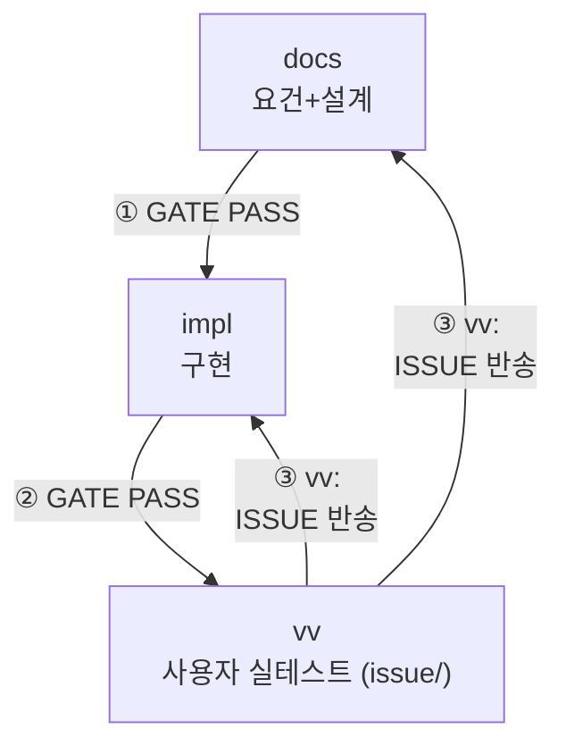
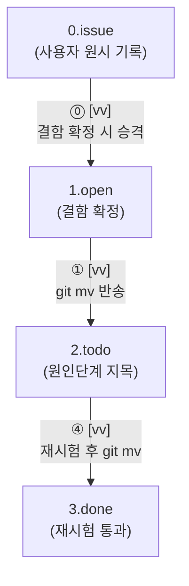
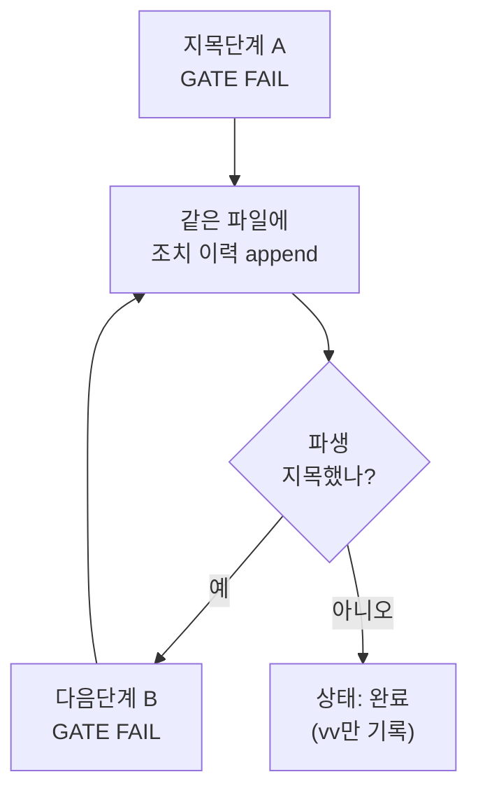

# issue

이 문서는 **사람이 구조를 파악하기 위한 것**이다. 지침은 루트 `AGENTS.md`를 본다.
폴더명은 `issue`지만 게이트 단계명은 여전히 `vv`다(`gate.ps1 vv`).

## 전체 파이프라인

①→②는 순서대로 일어난다. ③은 같은 시점에 vv가 어느 단계로 반송할지 **선택하는 것**이라
같은 번호를 붙였다 — 두 화살표 중 하나(또는 둘 다)가 실제로 발생한다.

- 상위 게이트가 `STATUS: PASS`일 때만 다음 단계가 시작한다. 판정 파일은
  `tools/gates/<단계>.GATE.md`에 있다.
- `vv`는 코드·문서를 고치지 않는다. 결함은 원인 단계로 **ISSUE 반송**한다.
- ISSUE 파일 자체는 이동하지 않는다 — 항상 `issue/2.todo` 안에 있다. 반송은 지목된 단계의
  게이트가 자동으로 FAIL 되는 것으로 이뤄진다.

## 이슈 폴더 — 상태는 위치다

- `0.issue`는 사용자가 형식 없이 그대로 적는 자리다. **게이트가 보지 않는다** —
  미완성 기록이 파이프라인을 막으면 안 되기 때문이다. 결함으로 확정돼야 `1.open`으로
  승격되고, 그때부터 게이트 판정 대상이 된다.
- 폴더 이동은 승격(⓪)·반송(①)·완료(④) 세 번뿐이다. 그 사이 여러 단계가 같은 이슈를
  주고받는 동안은 파일이 `2.todo`에 머문 채 프론트매터만 바뀐다 — 아래 흐름.

## ISSUE 처리 흐름 — 프론트매터(같은 파일 안에서 진행)

- **자동 FAIL**: `gate.ps1`이 프론트매터의 `원인단계:` 또는 `조치.파생:`을 읽어 자기 단계
  이름이 나오는데 자기 조치 이력이 없으면 스스로 게이트를 FAIL 시킨다. 사람이 손으로
  고치지 않는다.
- **조치 append**: 지목단계는 새 이슈 파일을 만들지 않는다. 같은 파일 프론트매터의
  `조치:` 리스트에 자기 항목을 추가하고, 본문에 `## 조치: <단계> (<일시>)` 섹션을 덧붙인다.
- **파생**: 조치하면서 다른 단계도 손봐야 하면 `파생:`에 그 단계를 적는다 — vv를 거치지
  않고 그 단계의 다음 `gate.ps1` 실행이 자동으로 이어받는다. **단계끼리 직접 이어간다**,
  vv는 중간에 관여 안 함.
- **완료**: 파생 체인이 전부 끝나면(마지막 조치의 `파생:`이 비어있으면) vv가 재시험하고
  `3.done`으로 옮긴다(위 폴더 이동 흐름 ④). `상태:`를 완료로 적는 것은 vv만 한다.

절차 상세는 `by-issue-return` 스킬을 본다.

## TC는 선택

vv 게이트는 **TC 문서를 요구하지 않는다.** 실사용에서 TC를 만들기 어렵고 유효성도 떨어져
강제를 폐지했다. 게이트가 보는 것은 미해결 이슈(`1.open`·`2.todo`)가 비어
있는지 뿐이다. 시험 절차를 적어둬야 할 필요가 있으면 `by-acceptance-test-design` 스킬로
`issue/TC.md`를 쓰되, 게이트 판정 대상은 아니다. 실행 기록도 필요할 때만 `issue/results/`에 남긴다.
